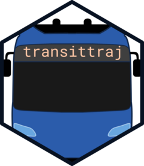
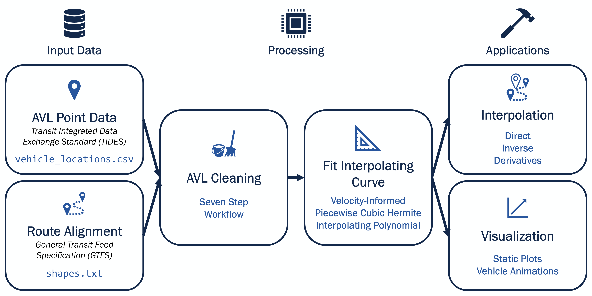

<!-- README.md is generated from README.Rmd. Please edit that file -->

```{r, include = FALSE}
knitr::opts_chunk$set(
  collapse = TRUE,
  comment = "#>",
  fig.path = "man/figures/",
  out.width = "100%"
)
```

# transittraj <a href="https://obrien-ben.github.io/transittraj/"></a>

<!-- badges: start -->
<!-- badges: end -->

**Transport Chicago 2026 Attendees**: *For code & references related to the*
`transittraj` *poster, check out* `vignette("articles/tc26")`.

An R package for reconstructing and visualizing transit vehicle trajectories. 

## Introduction

Today's transit vehicles generate a large amount of automatic vehicle location
(AVL) data. This data is vital in planning and performance studies, but turning
sparse and noisy GPS pings into meaningful performance metrics is difficult.
`transittraj` fills this gap, integrating with existing open data standards,
including GTFS and TIDES, to provide tools for cleaning AVL data and fitting
continuous, monotonic, invertible, and differentiable trajectory curves. 
By doing so, `transittraj` provides versatile and powerful tools to analyze
transit system performance and support decision-making.

``` {r, echo = FALSE, out.width = "100%", fig.align = "center", fig.cap = "`transittraj` turns noisy GPS data (left) into a trajectory (right) meeting the four requirements discussed below"}
knitr::include_graphics("man/figures/README-example2.png")
```

## Installation

You can install the development version of `transittraj` from
[GitHub](https://github.com/) with:

``` r
# install.packages("pak")
pak::pak("UTEL-UIUC/transittraj")
```

## Statement of Need

The primary goal of `transittraj` is to reconstruct *trajectories* of transit
vehicles from AVL data. A trajectory is a function which describes the
one-dimensional position (i.e., the distance from a trip's beginning) of a
transit vehicle over time. Vehicle trajectories are incredibly powerful and
versatile tools, and are widely used by traffic engineers and operations
researchers for planning and system performance studies.

Transit professionals, however, rarely have the opportunity to see detailed
trajectories of their vehicles, and instead typically only receive finalized
metrics -- such as dwell times and segment-level travel times -- from analytics
platforms. If a practitioner wanted to apply trajectory fitting tools from
parallel fields, they would likely encounter challenges: transit data adheres
to unique formatting standards; very few open-source tools exist for handling
transit vehicle location data; and, most importantly, common GPS processing
techniques can oversmooth transit trajectories because AVL pings occur with the
same frequency (15-30 seconds) as stop dwells, signal delays, and other
stop-and-go cycles.

`transittraj` fills this gap by proposing a workflow with two main
steps. The first is data cleaning, where we focus on correcting noise and
errors in point observations. Second, we use cleaned position and speed
measurements to fit an interpolating curve representing the vehicle's
trajectory. This curve has four important attributes:

- *Continuous*: There should be no gaps in the trajectory for each trip.

- *Monotonic*: The vehicle's position should strictly increase.

- *Invertible*: The trajectory should provide position as a function of time,
or time as a function of position.

- *Differentiable*: At any point on the curve, we should be able to interpolate
for the speed of the vehicle.

`transittraj` aims to make these workflows as smooth and accessible as possible.
We begin with data that adheres to industry standard data formats, including
[GTFS](https://gtfs.org/) and [TIDES](https://tides-transit.org/main/), and
functions are flexible but avoid techniques which require complex tuning.
Finally, we provide tools to visualize and apply fit trajectory curves. 

``` {r, out.width = "100%", fig.cap = "Overview of `transittraj` workflow", fig.align = "center", echo = FALSE}

```

Check out the vignettes below to get started.

## Getting Started with `transittraj`

Check out the following vignettes to learn more about how to use `transittraj`:

- [Understanding Data Inputs](https://utel-uiuc.github.io/transittraj/articles/input-data-la.html)

- [The AVL Cleaning Workflow](https://utel-uiuc.github.io/transittraj/articles/data-workflow-la.html)

- [Using Trajectories](https://utel-uiuc.github.io/transittraj/articles/intro-trajectories-la.html)

Check out some case studies from the research team that demonstrate
`transittraj` in real-world projects:

- [Estimating Signal Delays in Indianapolis](https://utel-uiuc.github.io/transittraj/articles/indygo-signals.html)

## Works in Progress

This package is still in early development. In preparation for an eventual
submission to CRAN, we're still working on the following:

- Examples in all function documentation

- Formal automated testing

- Vignettes demonstrating applications of `transittraj`

Check out the latest updates at our
[changelog](https://utel-uiuc.github.io/transittraj/news/index.html).

## Citation

`transittraj` is free and open source, but if you find the package helpful,
we'd appreciate a citation:

``` {r}
citation("transittraj")
```
