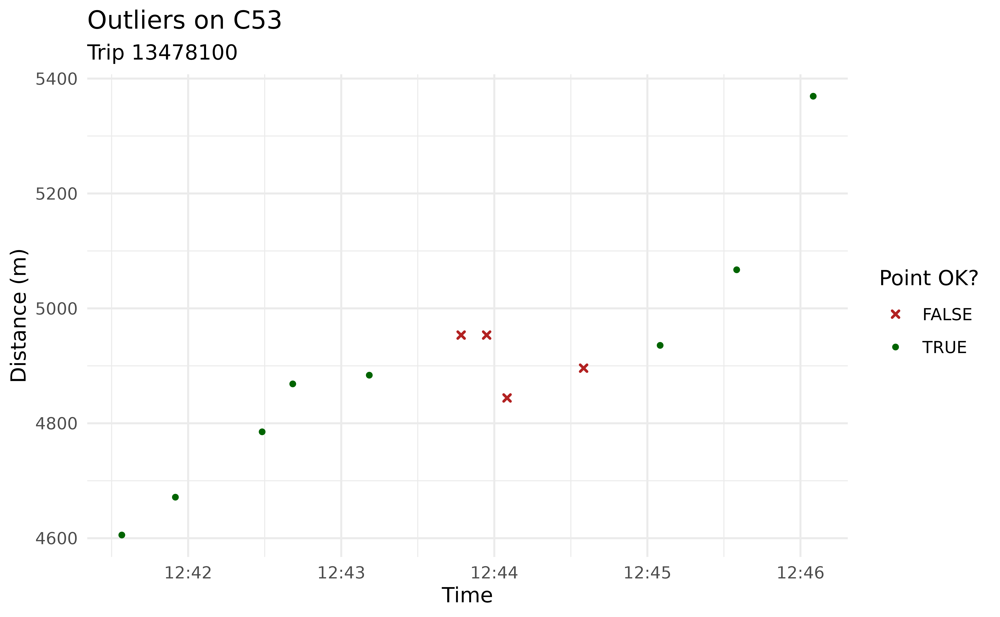
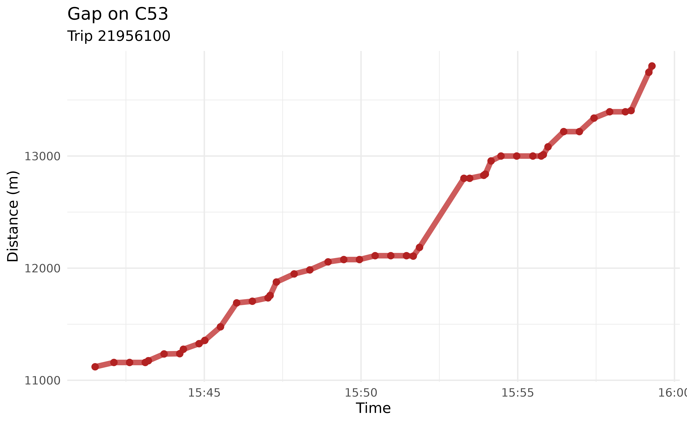
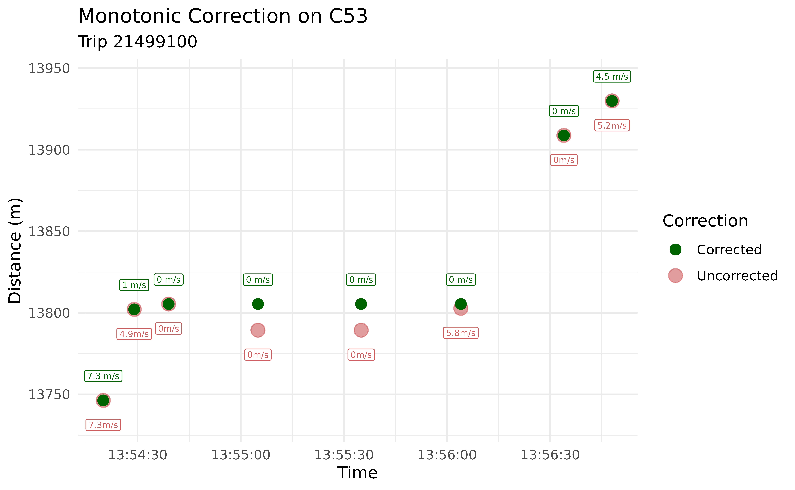

# The AVL Cleaning Workflow

## Introduction

In this vignette, we will walk through `transittraj`’s entire AVL
cleaning and trajectory reconstruction workflow. Check out
[`vignette("input-data")`](https://obrien-ben.github.io/transittraj/articles/input-data.md)
to learn more about the AVL and GTFS data we’ll be using.

Let’s begin by loading the libraries we’ll be using:

``` r
library(transittraj)
library(tidytransit)
library(dplyr)
library(sf)
library(ggplot2)
```

## Step 0: Setup

We’ll begin by setting up our data. We’ll be using `wmata_avl` and
`wmata_gtfs` for our TIDES AVL and static GTFS input, respectively.

### AVL

For this example, we’ll work with WMATA’s C53 bus route in the
northbound direction. Let’s filter our AVL data to these specifications:

``` r
# Set our filtering parameters
c53 <- "C53"
c53_dir <- 0 # 0 is NB, 1 is SB

# Filter the entire AVL to just the NB C53
c53_avl <- wmata_avl %>%
  filter((route_id == c53) & (direction_id == c53_dir))
```

Now our dataset should include only northbound C53 trips. We can see
below that this window has about 5,400 individual GPS pings across 33
trips and 5 hours.

``` r
# Pull attributes about our filtered AVL
total_obs <- dim(c53_avl)[1]
num_trips <- length(unique(c53_avl$trip_id_performed))
time_span <- round(max(c53_avl$event_timestamp) - min(c53_avl$event_timestamp),
                   2)

# Print attributes
cat("Total Observations: ", total_obs,
    "\nNumber of trips: ", num_trips,
    "\nTime span: ", time_span, " hr",
    sep = "")
#> Total Observations: 5436
#> Number of trips: 33
#> Time span: 5.02 hr
```

### GTFS

Next, we should grab the GTFS shape and feed information we want for
this route and direction. `transittraj` provides a couple functions to
help with this. We’ll start by filtering our GTFS to just the northbound
C53:

``` r
# Filter the entire GTFS down to NB C53
c53_gtfs <- filter_by_route(gtfs = wmata_gtfs,
                            route_ids = c53,
                            dir_id = c53_dir)
```

If we print a summary of this GTFS object, we’ll see that it only
contains one route:

``` r
summary(c53_gtfs)
#> tidygtfs object
#> files        agency, routes, stop_times, trips, shapes, calendar, calendar_dates, stops
#> agency       WMATA
#> service      from 2025-12-14 to 2026-06-13
#> uses         stop_times (no frequencies)
#> # routes       1
#> # trips      952
#> # stop_ids    57
#> # stop_names  57
#> # shapes       2
```

Now that we have the filtered GTFS, we must pull the shape we want as a
simple feature (SF) spatial object. You will need to know two things to
do this:

- Your `shape_id`. As shown above, there are two `shape_id`s assigned to
  the northbound C53. Check out
  [`plot_interactive_gtfs()`](https://obrien-ben.github.io/transittraj/reference/plot_interactive_gtfs.md)
  to explore each shape individually and decide which one is correct for
  you. Here we use `shape_id = "C53:04"`.

- A coordinate reference system. We recommend projecting all spatial
  data into an appropriate Euclidian coordinate system. Below we use the
  UTM zone for Washington, DC, Zone 18N (with an EPSG number of 32618).

Now we can use
[`get_shape_geometry()`](https://obrien-ben.github.io/transittraj/reference/get_shape_geometry.md)
to grab the `shape_id` we want, turn it into a spatial line, and project
it to the appropriate coordinate system:

``` r
# Set our parameters
c53_NB_shape_id <- "C53:04"
dc_CRS <- 32618

# Pull the shape we want
c53_shape <- get_shape_geometry(gtfs = c53_gtfs,
                                shape = c53_NB_shape_id,
                                project_crs = dc_CRS)
```

If we print this new object, we’ll see that it is one multilinestring
with `shape_id = "C53:04"` and the coordinate system UTM 18N.

``` r
print(c53_shape)
#> Simple feature collection with 1 feature and 1 field
#> Geometry type: MULTILINESTRING
#> Dimension:     XY
#> Bounding box:  xmin: 322061.8 ymin: 4301418 xmax: 329233.3 ymax: 4310353
#> Projected CRS: WGS 84 / UTM zone 18N
#> # A tibble: 1 × 2
#>   shape_id                                                              geometry
#>   <chr>                                                    <MULTILINESTRING [m]>
#> 1 C53:04   ((327507.1 4301484, 327505.6 4301478, 327504.9 4301473, 327504 43014…
```

### Visualizing our Starting Data

We now have all the data we need to proceed. But before we do, let’s
visualize the AVL points and route geometry so we understand what we’re
working with:

``` r
# Convert GPS points to spatial objects
# You typically won't need to do this -- this is just for visualization
c53_sf <- c53_avl %>%
  # As SF
  st_as_sf(coords = c("longitude", "latitude"),
           crs = 4326) %>%
  # Project to DC
  st_transform(crs = dc_CRS)

# Generate a map
avl_map <- ggplot() +
  # Basemap from OSM
  ggspatial::annotation_map_tile(type = "cartolight", zoomin = 0,
                                 progress = "none") +
  # Add alignment & points
  geom_sf(data = c53_shape, color = "red", linewidth = 1.5) +
  geom_sf(data= c53_sf, color = "blue",
          alpha = 0.2, size = .7) +
  # Format our map
  theme_void() +
  labs(title = "C53 Shape & AVL") +
  theme(plot.title = element_text(size = 8))
avl_map
```


For the most part, our GPS pings follow the route alignment excellently.
But what’s the deal with the points off-route in the far south? These
pings roughly follow I-295 down to the Blue Plains neighborhood. They
end roughly at the location of WMATA’s [Shepherd
Parkway](https://maps.app.goo.gl/RWNECRptbsDovPBJA) bus garage. The C53
is dispatched out of Shepherd, and most vehicles take I-295 to get
between Shepherd and their starting/ending locations.

Knowing this, these points most likely correspond to one (or more)
deadheading vehicles that were logged into a trip but were not actually
in revenue service. This is a pretty common phenomenon across AVL
vendors. `transittraj` includes functions intended to identify and
remove potential deadheads. We’ll begin exploring these in the following
section.

## Steps 1 & 2: Buffer & Linearize

Now that we have our data, we can begin cleaning and processesing it.
The first two steps we recommend are:

- **Step 1: Buffer**. Clip GPS points to within a certain distance of
  the route alignment.

- **Step 2: Linearize**. Project GPS points onto the route alignment to
  retrieve the linear distance from the start of the route.

Both steps are bundled into one function,
[`get_linear_distances()`](https://obrien-ben.github.io/transittraj/reference/get_linear_distances.md).
There are two main decision variables for this function:

- The projection CRS. This should be the same one you used to create
  your route shape.

- The buffer distance. This will be in the units of your spatial
  projection. Here we’re using UTM, which is in meters. Thus, all
  distance measurements you see in the vignette will be in meters.

For this example, we’ll continue using UTM Zone 18N, and we’ll only keep
points within 50 meters of the route alignment. This should take care of
those deadheading points we saw earlier.

### Running the Code

We can now clip and linearize our AVL dataframe using
[`get_linear_distances()`](https://obrien-ben.github.io/transittraj/reference/get_linear_distances.md):

``` r
# Set parameters
c53_buffer = 50 # meters

# Run the cleaning function
c53_distances <- get_linear_distances(avl_df = c53_avl,
                                      shape_geometry = c53_shape,
                                      project_crs = dc_CRS,
                                      clip_buffer = c53_buffer)
```

### Exploring the Results

Now each observation is represented by a distance from the route’s
beginning. Let’s first see how many observations were clipped out:

``` r
# Pull dimensions of each
step0_obs <- dim(c53_avl)[1]
step1_obs <- dim(c53_distances)[1]

# Print
cat("Initial: ", step0_obs, " obs",
    "\nAfter buffer: ", step1_obs, " obs",
    "\nDifference: ", (step0_obs - step1_obs), " obs removed")
#> Initial:  5436  obs 
#> After buffer:  4946  obs 
#> Difference:  490  obs removed
```

We had just under 500 observations clipped out of our dataset. We can
also take a look at the new header of our dataset:

``` r
head(c53_distances)
#>   location_ping_id vehicle_id trip_id_performed service_date route_id
#> 1                1       5461          18632100   2026-02-16      C53
#> 2                3       5464          14078100   2026-02-16      C53
#> 3                4       5466          25836100   2026-02-16      C53
#> 4                6       5473           8428100   2026-02-16      C53
#> 6                8       5481           1115100   2026-02-16      C53
#> 7                9       5479            842100   2026-02-16      C53
#>   direction_id   speed trip_stop_sequence     event_timestamp stop_id
#> 1            0  0.0000                 63 2026-02-16 10:58:09    7219
#> 2            0 10.9728                 52 2026-02-16 10:58:31    6843
#> 3            0  0.0000                  2 2026-02-16 10:58:27   13111
#> 4            0  4.5720                 63 2026-02-16 10:58:02    7219
#> 6            0  7.9248                 41 2026-02-16 10:58:10   28286
#> 7            0  8.8392                 29 2026-02-16 10:58:24    4520
#>       distance
#> 1 1.534625e+04
#> 2 1.205652e+04
#> 3 4.191312e-02
#> 4 1.535750e+04
#> 6 9.512327e+03
#> 7 6.551790e+03
```

Now, instead of `latitude` and `longitude` columns, we have a single
numeric `distance` column. We will only work with these one-dimensional
distances for the rest of this vignette.

## Step 3: Cleaning Overlapping Subtrips

In some AVL systems, multiple vehicle or operator IDs can be recorded
for the same trip. Sometimes this is okay: there may, for example, be an
operator shift change mid-trip. Other times, however, these multiple
vehicles/operators are logged in at the same time (“overlapping”). This
creates problems, as it becomes impossible for `transittraj` to
understand what the trip is *supposed* to be doing.

For **Step 3** of the cleaning workflow,
[`clean_overlapping_subtrips()`](https://obrien-ben.github.io/transittraj/reference/clean_overlapping_subtrips.md)
identifies and removes these trips. Each distinct “subtrip” (a unique
combination of trip ID, vehicle ID, and operator ID) is identified, then
we check whether the time ranges of these subtrips overlap. There are a
few key decision variables:

- Should operator IDs be checked? This will look for overlapping
  operator IDs in each trip.

- If a subtrip has only one observation assigned to it, should it be
  removed?

- Should trips with multiple subtrips that do *not* overlap be removed?

The WMATA dataset does not have include operator IDs, so we will not
check for operators. We’ll say that it’s okay to leave in subtrips that
aren’t overlapping.

### Running the Code

Below we use `c53_cleaned_subtrips()` to identify and remove problematic
trips:

``` r
# Set parameters
c53_check_op <- FALSE
c53_remove_singles <- TRUE
c53_remove_non_overlap <- FALSE

# Run function
c53_cleaned_subtrips <- clean_overlapping_subtrips(
  distance_df = c53_distances,
  check_operator = c53_check_op,
  remove_single_observations = c53_remove_singles,
  remove_non_overlapping = c53_remove_non_overlap
)
```

### Exploring the Results

Let’s see how many trips or observations were removed:

``` r
# Pull new dimensions
step3_obs <- dim(c53_cleaned_subtrips)[1]

# Print
cat("Initial: ", step1_obs, " obs",
    "\nAfter: ", step3_obs, " obs",
    "\nDifference: ", (step1_obs - step3_obs), " obs removed")
#> Initial:  4946  obs 
#> After:  4945  obs 
#> Difference:  1  obs removed
```

We can see that only one observation violated our requirements. To see
what that observation is, we’ll introduce a new feature of
`transittraj`: the `return_removals` parameter. Each cleaning function
used in this vignette allows a parameter `return_removals` that, when
set to `TRUE`, will return a dataframe of the points/trips removed
through that step and a brief explanation of why they were removed.
Let’s check it out:

``` r
# Get removals from previous function
c53_step3_removals <- clean_overlapping_subtrips(
  # Same settigns as before
  distance_df = c53_distances,
  check_operator = c53_check_op,
  remove_single_observations = c53_remove_singles,
  remove_non_overlapping = c53_remove_non_overlap,
  # Return removals
  return_removals = TRUE
)

# Print removed point
print(c53_step3_removals)
#> # A tibble: 1 × 7
#>   trip_id_performed subtrip   n_obs reason action time_range n_subtrips_in_range
#>   <chr>             <chr>     <int> <chr>  <chr>   <iv<dbl>>               <int>
#> 1 8428100           8428100-…     1 singl… remov…   [NA, NA)                  NA
```

We can see the trip and subtrip (`trip_id`-`vehicle_id`) which was
removed, and that it was removed because it was a single observation.
Let’s see what this trip looked like in the original dataset:

``` r
# Filter & print to violating trip
print(c53_distances %>%
        filter(trip_id_performed == "8428100"))
#>   location_ping_id vehicle_id trip_id_performed service_date route_id
#> 1                6       5473           8428100   2026-02-16      C53
#>   direction_id speed trip_stop_sequence     event_timestamp stop_id distance
#> 1            0 4.572                 63 2026-02-16 10:58:02    7219  15357.5
```

This trip, in fact, only had one observation total. It makes sense to
remove this – we can’t do much with a single observation.

## Step 4: Clean Outlier/Jumps

GPS data, especially in urban areas, is noisy. Sometimes that noise
manifests as a large instantaneous jump that does not match an points’s
surrounding observations. In **Step 4**, the function
[`clean_jumps()`](https://obrien-ben.github.io/transittraj/reference/clean_jumps.md)
detects and removes these using median filters. Read more about the
theory behind these filters using
[`help(clean_jumps)`](https://obrien-ben.github.io/transittraj/reference/clean_jumps.md).

For this example, we’ll do a very simple median filter using only
deviation from the median around each point. This has two main decision
variables:

- The neighborhood width, the total number of points to consider around
  each observation.

- The maximum distance between a point and the median of the
  neighborhood around it. This can be defined as an absolute distance
  from the median, in distance units, or as a multiple of the window’s
  median absolute deviation (MAD) (this is known as a *Hampel filter*).

For this example, we’ll use the default neighborhood width of 7 (3
points on either side of each observation). We’ll keep our outlier
criteria simple (though not very robust) and use a maximum deviation of
20 meters. This means that if any given point is more than 20 meters
away from the median of its surrounding points, it will be tossed.

### Running the Code

Let’s run
[`clean_jumps()`](https://obrien-ben.github.io/transittraj/reference/clean_jumps.md)
as discussed above. The only input we need to change from its default is
the maximum distance deviation.

``` r
# Set parameters
c53_max_jump <- 20 # meters
c53_min_jump <- -1 * c53_max_jump # meters

# Run function
c53_no_jumps <- clean_jumps(distance_df = c53_cleaned_subtrips,
                            max_median_deviation = c53_max_jump,
                            min_median_deviation = c53_min_jump,
                            t_cutoff = Inf)
```

### Exploring the Results

Let’s see how many points were removed as outliers from this filter:

``` r
# Pull dimensions
step4_obs <- dim(c53_no_jumps)[1]

# Print
cat("Initial: ", step3_obs, " obs",
    "\nAfter: ", step4_obs, " obs",
    "\nDifference: ", (step3_obs - step4_obs), " obs removed")
#> Initial:  4945  obs 
#> After:  4934  obs 
#> Difference:  11  obs removed
```

With these settings, 11 points were removed. We can use
`return_removals = TRUE`, just like in Step 3, to take a closer look at
these outlying points:

``` r
# Get removals
c53_step4_removals <- clean_jumps(
  # Same settings as before
  distance_df = c53_cleaned_subtrips,
  max_median_deviation = c53_max_jump,
  min_median_deviation = c53_min_jump,
  t_cutoff = Inf,
  # Return removals
  return_removals = TRUE)

# Print the removed points
print(c53_step4_removals)
#> # A tibble: 11 × 13
#>    trip_id_performed event_timestamp       distance location_ping_id window_med
#>    <chr>             <dttm>                   <dbl> <chr>                 <dbl>
#>  1 1306100           2026-02-16 12:43:47  4954.     16770                4884. 
#>  2 1306100           2026-02-16 12:43:57  4954.     16798                4896. 
#>  3 1306100           2026-02-16 12:44:05  4844.     16826                4936. 
#>  4 1306100           2026-02-16 12:44:35  4896.     16910                4954. 
#>  5 1306100           2026-02-16 13:31:22 13819.     24579               13789. 
#>  6 13478100          2026-02-16 15:37:40   108.     45428                  66.7
#>  7 35294100          2026-02-16 11:28:14    83.2    4721                   20.1
#>  8 35294100          2026-02-16 11:32:14     0.0419 5369                   20.1
#>  9 35294100          2026-02-16 11:37:49     0.0419 6260                   20.1
#> 10 35294100          2026-02-16 11:39:13   257.     6476                   83.2
#> 11 35294100          2026-02-16 11:40:34    11.2    6692                  214. 
#> # ℹ 8 more variables: window_mad <dbl>, med_dist <dbl>, is_implosion <lgl>,
#> #   is_tail <lgl>, ignore_observation <lgl>, mad_ok <lgl>, dev_ok <lgl>,
#> #   all_ok <lgl>
```

Let’s explore pings 16770 through 16910 from trip 1306100 as an example.
We can plot the trip in this area to visualize the outliers:

``` r
# Filter dataframe to our tirp & distances
plot_df <- c53_cleaned_subtrips %>%
  filter(trip_id_performed == "1306100") %>%
  filter((distance >= 4500) & (distance <= 5500)) %>%
  # Join removals
  left_join(y = (c53_step4_removals %>% select(location_ping_id, all_ok)),
            by = "location_ping_id") %>%
  mutate(all_ok = tidyr::replace_na(all_ok, TRUE))

# Create a plot
jumps_plot <- ggplot() +
  # Plot the points
  geom_point(data = plot_df,
             aes(x = event_timestamp, y = distance,
                 color = all_ok, shape = all_ok),
             size = 3, stroke = 3) +
  # Format the points
  scale_color_manual(name = "Point OK?",
                     values = c("FALSE" = "firebrick",
                                "TRUE" = "darkgreen")) +
  scale_shape_manual(name = "Point OK?",
                     values = c("FALSE" = 4,
                                "TRUE" = 16)) +
  # Format the plot
  theme_minimal() +
  labs(x = "Time",
       y = "Distance (m)",
       title = "Outliers on C53",
       subtitle = "Trip 13478100")
jumps_plot
```



This plot makes it pretty clear that some of these points are a bit out
of line. The final one removed may not truly be an outlier; we recommend
playing around with the function’s options to find settings that make
sense for your data. Again, there are a handful of customization options
available through this function that we recommend exploring. Read more
at
[`help(clean_jumps)`](https://obrien-ben.github.io/transittraj/reference/clean_jumps.md).

## Step 5: Clean Incomplete Trips

AVL or GTFS-rt data is rarely transmitted perfectly. Often, there may be
large gaps of missing data in the middle of trips, or you may have only
a few observations from each trip. For **Step 5**, the function
[`clean_incomplete_trips()`](https://obrien-ben.github.io/transittraj/reference/clean_incomplete_trips.md)
filter out these trips There are two main groups of decision variables
for this function:

- Minimum and maximum trip distances and durations.

- Minimum and maximum gaps between adjacent observations.

This function will remove the entirety of trips that violate your
decision variables.

For this example, we’ll use a minimum trip distance of 500 meters, and a
minimum trip duration of 90 seconds. Anything will less data than this
will be filtered out. Additionally, we’ll remove trips with a gap larger
than 500 meters.

### Running the Code

Let’s run
[`clean_incomplete_trips()`](https://obrien-ben.github.io/transittraj/reference/clean_incomplete_trips.md)
as discussed above:

``` r
# Set parameters
c53_min_dist <- 500 # meters
c53_min_time <- 90 # seconds
c53_max_gap <- 500 # meters

# Run function
c53_cleaned_incompletes <- clean_incomplete_trips(
  distance_df = c53_no_jumps,
  min_trip_distance = c53_min_dist,
  min_trip_duration = c53_min_time,
  max_distance_gap = c53_max_gap
)
```

### Exploring the Results

Now that we’ve filtered our dataset, let’s see how many trips have been
removed:

``` r
step5_obs <- dim(c53_cleaned_incompletes)[1]
step5_trips <- length(unique(c53_cleaned_incompletes$trip_id_performed))
step4_trips <- length(unique(c53_no_jumps$trip_id_performed))

cat("Initial: ", step4_obs, " obs, ", step4_trips, " trips",
    "\nAfter: ", step5_obs, " obs, ", step5_trips, " trips",
    "\nDifference: ", (step4_obs - step5_obs), " obs, ",
    (step4_trips - step5_trips), " trips removed",
    sep = "")
#> Initial: 4934 obs, 31 trips
#> After: 4089 obs, 24 trips
#> Difference: 845 obs, 7 trips removed
```

7 trips violated our requirements, corresponding to roughly 850
individual observations. As before, we can use `return_removals` to take
a look at the violating trips:

``` r
c53_step5_removals <- clean_incomplete_trips(
  # Same settings as before
  distance_df = c53_no_jumps,
  min_trip_distance = c53_min_dist, min_trip_duration = c53_min_time,
  max_distance_gap = c53_max_gap,
  # Return removals
  return_removals = TRUE
)
print(c53_step5_removals)
#> # A tibble: 7 × 16
#>   trip_id_performed max_dist   min_dist max_time            min_time           
#>   <chr>                <dbl>      <dbl> <dttm>              <dttm>             
#> 1 13927100              127.     0      2026-02-16 14:36:57 2026-02-16 14:36:27
#> 2 14639100            15362.     0      2026-02-16 12:38:36 2026-02-16 11:38:49
#> 3 18632100            15360. 15346.     2026-02-16 11:02:20 2026-02-16 10:58:09
#> 4 21956100            13803.   248.     2026-02-16 15:59:17 2026-02-16 14:45:27
#> 5 5516100             15259.     0.0419 2026-02-16 15:12:19 2026-02-16 13:52:44
#> 6 6533100             12118.     0.0419 2026-02-16 15:59:17 2026-02-16 14:52:21
#> 7 7879100             15363.     0.0419 2026-02-16 14:41:08 2026-02-16 13:26:33
#> # ℹ 11 more variables: max_dist_gap <dbl>, max_t_gap <dbl>,
#> #   max_dist_gap_id <chr>, max_t_gap_id <chr>, trip_distance <dbl>,
#> #   duration <dbl>, dist_ok <lgl>, dur_ok <lgl>, dist_gap_ok <lgl>,
#> #   t_gap_ok <lgl>, all_ok <lgl>
```

Most of these were removed because of a large gap in data. Let’s take a
look at one, trip 21956100:

``` r
# Filter dataframe to our tirp & distances
plot_df <- c53_cleaned_subtrips %>%
  filter(trip_id_performed == "21956100") %>%
  filter((distance >= 11000) & (distance <= 14000))

# Create a plot
gaps_plot <- ggplot() +
  # Plot the points
  geom_line(data = plot_df,
            aes(x = event_timestamp, y = distance),
            linewidth = 2, color = "lightcoral") +
  geom_point(data = plot_df,
             aes(x = event_timestamp, y = distance),
             size = 2, color = "firebrick4") +
  # Format the plot
  theme_minimal() +
  labs(x = "Time",
       y = "Distance (m)",
       title = "Gap on C53",
       subtitle = "Trip 21956100")
gaps_plot
```



We can see this trip’s gap around 12,500 meters. The slope of this line
is a bit steep, but is not unreasonable; it looks like a few GTFS-rt
pings just went missing here. When we go to reconstruct a trajectory
curve later, it may not be reasonable to interpolate between these
points over such a large distance, so we’ll leave this trip out of our
future analyses.

## Step 6: Trim Trip Tails

Earlier in this vignette, we used a spatial buffer to clean what
appeared to be deadheads. But what if a trip deadheads close to – or
along – the route alignment? In **Step 6**, the function
[`trim_trips()`](https://obrien-ben.github.io/transittraj/reference/trim_trips.md)
is designed to handle these scenarios by trimming the tails off of
trips.

The function identifies the observations with the minimum and maximum
distance values, and removes any observations which occur before/after
these points. There is one main decision variable here: should beginning
tails be trimmed, ending tails, or both? For this example, we’ll trim
both ends of trips:

### Running the Code

Let’s run
[`trim_trips()`](https://obrien-ben.github.io/transittraj/reference/trim_trips.md),
trimming both the beginning and ends of each trip:

``` r
# Set parameters
c53_trim_type <- "both"

# Run function
c53_trimmed <- trim_trips(distance_df = c53_cleaned_incompletes,
                          trim_type = c53_trim_type)
```

### Exploring the Results

Let’s see what was removed:

``` r
# Pull dimensions
step6_obs <- dim(c53_trimmed)[1]

# Print
cat("Initial: ", step5_obs, " obs",
    "\nAfter: ", step6_obs, " obs",
    "\nDifference: ", (step5_obs - step6_obs), " obs removed")
#> Initial:  4089  obs 
#> After:  4086  obs 
#> Difference:  3  obs removed
```

For this example, it looks like there were no long deadheads along the
route alignment. Whether this function will make a difference will
largely depend on the dataset and routes you’re working with. Let’s take
a look at a the points removed:

``` r
c53_step6_removals <- trim_trips(
  # Same settings as before
  distance_df = c53_cleaned_incompletes,
  trim_type = c53_trim_type,
  # Return removals
  return_removals = TRUE
)

print(c53_step6_removals)
#> # A tibble: 3 × 10
#>   trip_id_performed event_timestamp     distance min_dist_index max_dist_index
#>   <chr>             <dttm>                 <dbl>          <int>          <int>
#> 1 13478100          2026-02-16 15:59:11   2447.               1             88
#> 2 35294100          2026-02-16 11:26:04     18.8              3            202
#> 3 35294100          2026-02-16 11:26:34     94.3              3            202
#> # ℹ 5 more variables: row_index <int>, before_min <lgl>, after_max <lgl>,
#> #   obs_ok <lgl>, location_ping_id <chr>
```

We’ll plot the points removed along trip 35294100:

``` r
# Filter dataframe to our tirp & distances
plot_df <- c53_cleaned_incompletes %>%
  filter(trip_id_performed == "35294100") %>%
  filter(distance <= 200) %>%
  # Join removals
  left_join(y = (c53_step6_removals %>% select(location_ping_id, obs_ok)),
            by = "location_ping_id") %>%
  mutate(obs_ok = tidyr::replace_na(obs_ok, TRUE))

# Create a plot
trimmed_plot <- ggplot() +
  # Plot the points
  geom_point(data = plot_df,
             aes(x = event_timestamp, y = distance,
                 color = obs_ok, shape = obs_ok),
             size = 3, stroke = 3) +
  # Format the points
  scale_color_manual(name = "Point OK?",
                     values = c("FALSE" = "firebrick",
                                "TRUE" = "darkgreen")) +
  scale_shape_manual(name = "Point OK?",
                     values = c("FALSE" = 4,
                                "TRUE" = 16)) +
  # Format the plot
  theme_minimal() +
  labs(x = "Time",
       y = "Distance (m)",
       title = "Trimmed Trips on C53",
       subtitle = "Trip 35294100")
trimmed_plot
```


As noted before, this does not seem to be a long deadhead; just some
noise at the beginning of the route (by default,
[`clean_jumps()`](https://obrien-ben.github.io/transittraj/reference/clean_jumps.md)
does not look for jumps at the beginning/end of trips before a complete
median window can be formed). Whether this step is truly necessary will
depend on your dataset.

## Step 7: Correct for Monotonicity

While GPS noise can result in the large jumps we saw previously, it much
more often causes small deviations in observed locations. This creates
problems when fitting an interpolating trajectory curve, because if any
points drift backwards, the curve will be neither monotonic nor
invertible. In **Step 7** (the last one!), we will “pull” any
backtracking points up to where they should be. Optionally, data can
also be made *strictly* monotonic.

The function
[`make_monotonic()`](https://obrien-ben.github.io/transittraj/reference/make_monotonic.md)
has two decision variables:

- Should speeds be corrected to satisfy monotonicity? AVL speed location
  can help fit an excellent interpolating curve, but the values of
  observed speeds must meet certain conditions (known as
  [Fritsch-Carlson
  constraints](https://epubs.siam.org/doi/10.1137/0717021)) to produce a
  monotonic spline. If your AVL data has speed information, and you plan
  to use it when fitting a spline (the recommend interpolation method),
  set `correct_speed = TRUE` to guarantee the fit is monotonic.

- Should the trajectory be made *strictly* monotonic? This will identify
  perfectly flat regions can give them a slight upward slope. To be
  invertible, a trajectory must be strictly increasing, and never
  constant.

Our AVL dataset does have speeds, and we do want an invertible and
monotonic final trajectory. As such, we’ll correct the speeds to meet
the Fritsch-Carlson constraints, and we will add a distance error of
0.001 meters (1 mm). More information is available at
[`help(make_monotonic)`](https://obrien-ben.github.io/transittraj/reference/make_monotonic.md).

### Running the Code

Let’s run
[`make_monotonic()`](https://obrien-ben.github.io/transittraj/reference/make_monotonic.md)
using the parameters discussed above:

``` r
# Set parameters
c53_dist_error <- 0.001
c53_correct_speeds <- TRUE

# Run function
c53_mono <- make_monotonic(distance_df = c53_trimmed,
                           correct_speed = c53_correct_speeds,
                           add_distance_error = c53_dist_error)
```

### Exploring the Results

This function modifies existing data, but does not remove any points.
The total number of observations should stay the same:

``` r
# Pull dimensions
step7_obs <- dim(c53_mono)[1]

# Print
cat("Initial: ", step6_obs, " obs",
    "\nAfter: ", step7_obs, " obs",
    "\nDifference: ", (step6_obs - step7_obs), " obs removed")
#> Initial:  4086  obs 
#> After:  4086  obs 
#> Difference:  0  obs removed
```

We can check, though, if our dataset is now monotonic using
[`validate_monotonicity()`](https://obrien-ben.github.io/transittraj/reference/validate_monotonicity.md).
We’ll ask the function to validate speeds as well:

``` r
# Trimmed DF
step6_val <- validate_monotonicity(distance_df = c53_trimmed,
                                   check_speed = TRUE)
print(step6_val)
#>   weak strict  speed 
#>  FALSE  FALSE  FALSE

# Monotonic-corrected DF
step7_val <- validate_monotonicity(distance_df = c53_mono,
                                   check_speed = TRUE)
print(step7_val)
#>   weak strict  speed 
#>   TRUE   TRUE   TRUE
```

We can see the trimmed dataset did not satisfy weak, strict, or
Fristch-Carlson speed conditions for monotonicity, but the corrected
dataset did. We can also see exactly which points were adjusted, and by
how much, using the parameter `return_changes`. This is analagous to the
`return_removals` option we saw in previous steps.

Let’s visualize how this affected our data. Below we plot an example
trip, 21499100, around one stop it makes:

``` r
# Set filter parameters
plot_trip <- "21499100"
plot_dists <- c(13700, 13950)
# Get old DF
plot_df_before <- c53_trimmed %>%
  filter(trip_id_performed == plot_trip) %>%
  filter((distance >= plot_dists[1]) & (distance <= plot_dists[2])) %>%
  mutate(speed_label = paste(round(speed, 1), "m/s", sep = ""))
# Get corrected DF
plot_df_after <- c53_mono %>%
  filter(trip_id_performed == plot_trip) %>%
  filter((distance >= plot_dists[1]) & (distance <= plot_dists[2])) %>%
  mutate(speed_label = paste(round(speed, 1), " m/s", sep = ""))

# Plot
mono_plot <- ggplot() +
  geom_point(data = plot_df_before,
             aes(x = event_timestamp, y = distance,
                 color = "Uncorrected"),
             size = 4, alpha = 0.6) +
  geom_point(data = plot_df_after,
             aes(x = event_timestamp, y = distance,
                 color = "Corrected"),
             size = 3, alpha = 1) +
  geom_label(data = plot_df_before,
             aes(x = event_timestamp, y = distance,
                 color = "Uncorrected", label = speed_label),
            nudge_y = -15, size = 2.5, show.legend = FALSE) +
  geom_label(data = plot_df_after,
             aes(x = event_timestamp, y = distance,
                 color = "Corrected", label = speed_label),
            nudge_y = 15, size = 2.5, show.legend = FALSE) +
  scale_color_manual(name = "Correction",
                     values=  c("Uncorrected" = "indianred",
                                "Corrected" = "darkgreen")) +
  # Format the plot
  theme_minimal() +
  labs(x = "Time",
       y = "Distance (m)",
       title = "Monotonic Correction on C53",
       subtitle = paste("Trip ", plot_trip, sep = ""))
mono_plot
```



In this trip, the GPS backtracks slightly while the bus is supposed to
be stopped. The speeds are also larger than is physically feasible for a
monotonic trajectory as the bus enters and leaves this stop.
[`make_monotonic()`](https://obrien-ben.github.io/transittraj/reference/make_monotonic.md)
identified and corrected both issues.

## Conclusion

That was a lot of cleaning! But we now have a dataset free of outliers
and deadheading trips, and that we know will produce a monotonic and
invertible trajectory function. In the [next
vignette](https://utel-uiuc.github.io/transittraj/articles/intro-trajectories.html),
we will fit and explore these interpolating curves.
