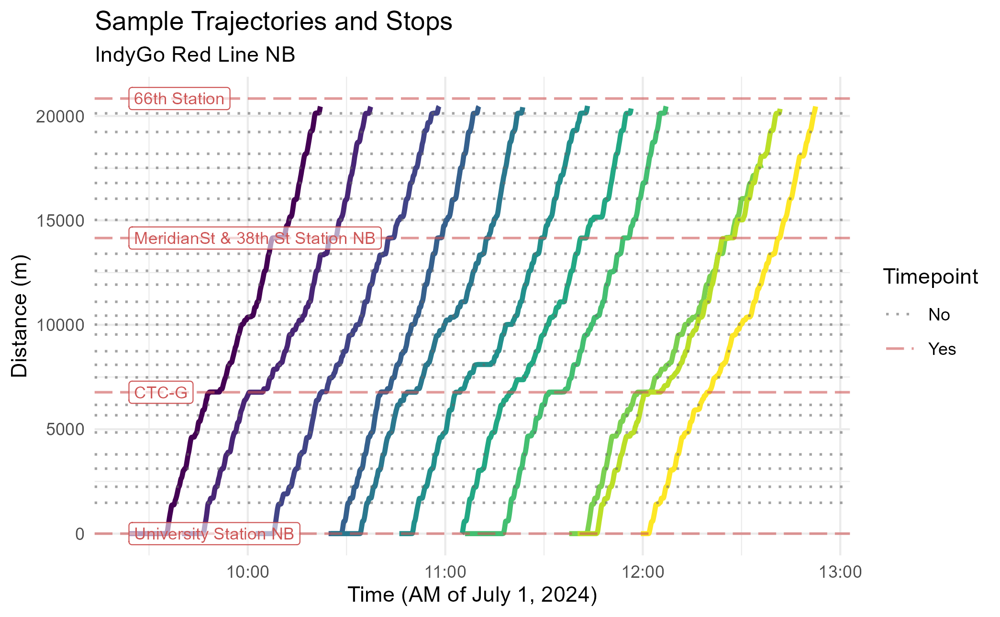
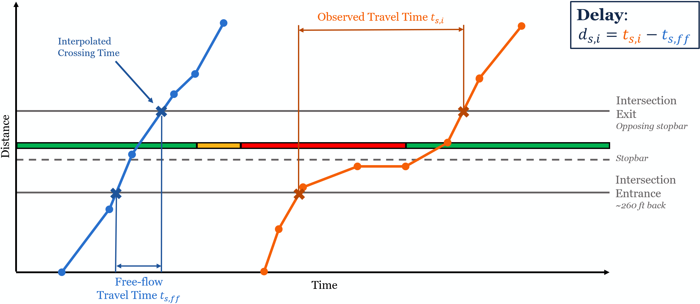
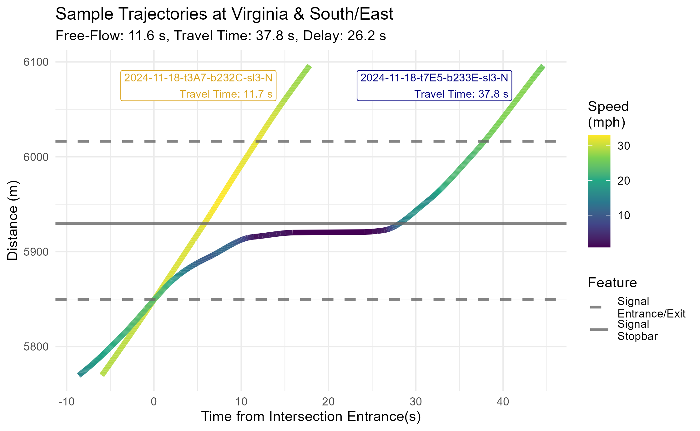
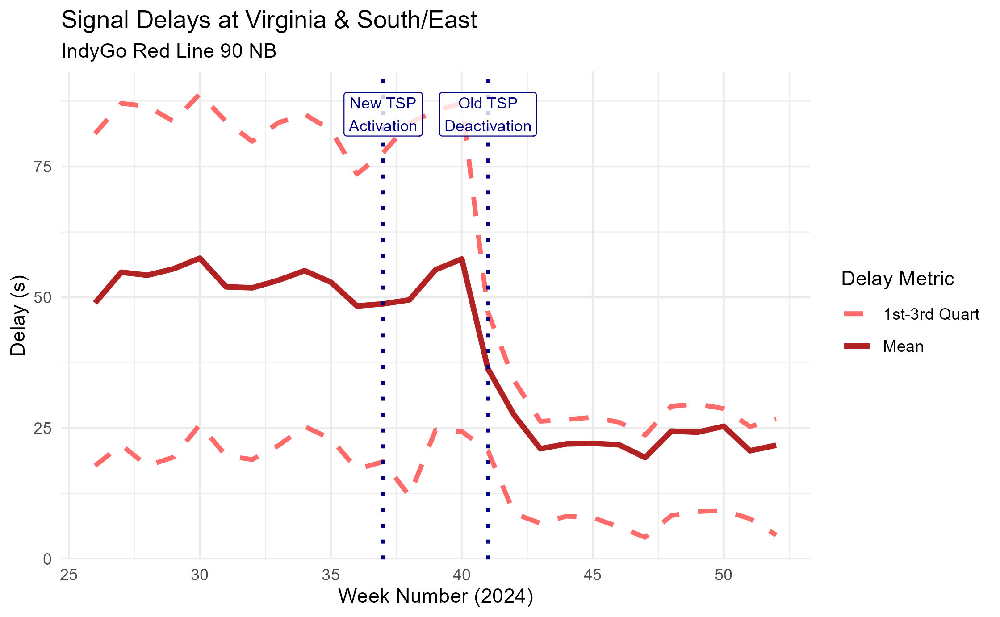
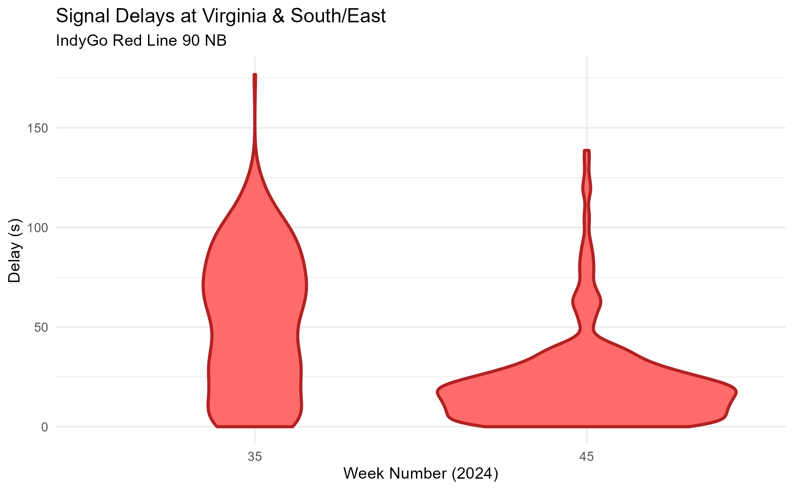

# Applying Trajectories: Signal Delays in Indianapolis, Indiana

## Introduction

In previous vignettes, we saw how `transittraj` can help clean AVL data
and fit interpolating trajectories. But how can these curves actually be
used?

This vignette will demonstrate how we’ve used `transittraj` to
understand delays at traffic signals along IndyGo’s bus rapid transit
routes. We’ll skip over the data cleaning process, and instead focus on
the applications of finalized trajectories. Check out
[`vignette("articles/input-data")`](https://obrien-ben.github.io/transittraj/articles/input-data.md)
to learn more about how to get started with your own data.

Let’s load some libraries to get started:

``` r
library(transittraj)
library(tidytransit)
library(tidyverse)
```

## Problem Context

IndyGo operates two BRT rotues in Indianapolis, Indiana, the Red and
Purple Lines. These routes have a variety of types of bus priority
infrastructure, including bus lanes and station-style stops, but the
focus of this study is on the transit signal priority (TSP) system.
Since its launch, the Red Line has had two generations of TSP: a
traditional call-based and conditional system, launched in September
2019; and a new cloud-based and unconditional system, launched when the
Purple Line opened in October 2024.

Our research goal was to use this natural experiment to understand how
the TSP upgrade affected signal delays along the Red Line. For this
project, we were concerned with both the central tendency and the
variation of signal delays. Our study window ran from July 1, 2024 to
December 31, 2024. This allowed us to capture the TSP upgrade in October
2024 with plenty of data before and after the change.

## Data

### Spatial Data

Spatial data typically starts as a GTFS object. If you’re unfamiliar
with IndyGo’s BRT system, explore it using the interactive GTFS viewer
below:

``` r
indy_map <- plot_interactive_gtfs(gtfs = indy_brt_gtfs,
                                  color = "gtfs")
indy_map
```

To find signal delays, we will need to the location of each signal’s
“entrance” and “exit”. The latitude/longitude locations of each stopbar
at each of the Red Line’s 62 signals were found using OpenStreetMaps and
satellite imagery, then projected onto the Red Line’s alignment (see
[`help(project_onto_route)`](https://obrien-ben.github.io/transittraj/reference/project_onto_route.md)).

``` r
head(stopbars)
```

    ##   routes              name    distance
    ## 1    90N   Shelby & Wesley    9.759449
    ## 2    90N   Shelby & Sumner  602.254030
    ## 3    90N     Shelby & Troy 1410.097237
    ## 4    90N  Shelby & Cameron 1698.392048
    ## 5    90N Shelby & Southern 2260.275318
    ## 6    90N  Shelby & Raymond 3046.512562

Each signal’s entrance was taken to be 80 meters upstream of that
signal’s stopbar; the exit was at the position of the opposing
direction’s stopbar. These windows were adjusted on a case-by-case basis
to ensure they captured the entire acceleration and decelaration curves
of the buses without capturing interference from nearby intersections,
driveways, or stops. Here’s a snippet of the resulting signal locations:

``` r
head(signal_boundings)
```

    ##               name inout  distance
    ## 1  Shelby & Sumner enter  522.2540
    ## 2  Shelby & Sumner  exit  645.2048
    ## 3    Shelby & Troy enter 1330.0972
    ## 4    Shelby & Troy  exit 1449.9983
    ## 5 Shelby & Cameron enter 1618.3920
    ## 6 Shelby & Cameron  exit 1740.4175

The final spatial layer was the position of each stop along the route
(see
[`help(get_stop_distances)`](https://obrien-ben.github.io/transittraj/reference/get_stop_distances.md)).
The Red Line has 28 station-style stops in each direction. From
conversations with IndyGo, we also identified the four stops which the
agency used as control timepoints.

``` r
head(stops)
```

    ## # A tibble: 6 × 6
    ##   stop_id stop_name                  distance route Timepoint label_name           
    ##   <chr>   <chr>                         <dbl> <chr> <chr>     <chr>                
    ## 1 70052   University Station NB            0  90N   Yes       University Station NB
    ## 2 70051   Troy Station NB               1478. 90N   No        <NA>                 
    ## 3 70049   Garfield Park Station NB      2245. 90N   No        <NA>                 
    ## 4 70047   Raymond Station NB            3113. 90N   No        <NA>                 
    ## 5 70045   Pleasant Run Station NB       3794. 90N   No        <NA>                 
    ## 6 70043   Fountain Square Station NB    4846. 90N   No        <NA>

### AVL Data

We accessed IndyGo’s AVL data from their Swiftly endpoint, after which
it was reformatted to meet the TIDES standards required by
`transittraj`. IndyGo’s buses had AVL polling frequencies ranging from 5
to 15 seconds. With trips every 10 to 15 minutes and a 6-month study
window, we started with nearly 5.2 million GPS pings and just over
10,000 individual trips on weekdays in each direction.

After implementing the full `transittraj` cleaning workflow to remove
deadheads, outlying pings, insufficient trips, and other issues, the
dataset had roughly 4.1 million pings across 9,300 trips per direction.
For the rest of this vignette, we’ll focus on the northbound direction.

### Processed Trajectories

After fitting interpolating trajectory curves to these cleaned and
monotonic data points, we can take a look at our trajectory object:

``` r
summary(indygo_traj)
```

    ## ------
    ## AVL Group Trajectory Object
    ## ------
    ## Number of trips: 9259
    ## Total distance range: 0 to 20500
    ## Total time range: 1719824733 to 1735707538
    ## ------
    ## Trajectory function present: TRUE
    ##    --> Trajectory interpolation method: monoH.FC
    ##    --> Maximum derivative: 3
    ##    --> Fit with speeds: TRUE
    ## Inverse function present: TRUE
    ##    --> Inverse function tolerance: 0.01
    ## ------

We can also visualize a handful of these trajectories to get a feel for
the route. We’ll use `transittraj`’s
[`plot_trajectory()`](https://obrien-ben.github.io/transittraj/reference/plot_trajectory.md)
function:

``` r
# Set formatting parameters
plot_trips <- unclass(indygo_traj)[20:30]
traj_format <- data.frame(trip_id_performed = plot_trips,
                          color = viridis::viridis(n = length(plot_trips)))
feature_format <- data.frame(Timepoint = c("Yes", "No"),
                             color = c("indianred3", "grey40"),
                             linetype = c("longdash", "dotted"))

traj_plot <- plot_trajectory(
  # Input trajectory data
  trajectory = indygo_traj, plot_trips = plot_trips,
  # Format trajectories
  traj_color = traj_format, traj_legend = FALSE, traj_width = 1.2,
  # Format features
  feature_distances = stops, label_field = "label_name",
  feature_color = feature_format, feature_type = feature_format,
  feature_alpha = 0.6, feature_width = 0.6
) +
  # Override default labels
  labs(x = "Time (AM of July 1, 2024)",
       y = "Distance (m)",
       title = "Sample Trajectories and Stops",
       subtitle = "IndyGo Red Line NB")
traj_plot
```



## Methods

The primary goal of this example is calculate the delay at each signal
for each trip. For traffic engineers, delay is defined as the difference
between the free-flow travel time and observed travel time through an
intersection.



### Travel Times

We’ll start by calculating the signal travel times of each trip. To
accomplish this, we’ll use the `transittraj`
[`predict()`](https://rdrr.io/r/stats/predict.html) methods. This
function allows uses the interpolating function stored inside a
trajectory object to find the times each vehicle entered and exited each
signal. To accomplish this, we’ll put our signal entrance/exit distances
into [`predict()`](https://rdrr.io/r/stats/predict.html) using the
`new_distances` parameter. This will tell
[`predict()`](https://rdrr.io/r/stats/predict.html) to use the inverse
trajectory function:

``` r
# Perform interpolation
crossing_times <- predict(object = indygo_traj,
                          new_distances = signal_boundings) %>%
  rename(time_interp = interp)

# Print example
head(crossing_times)
```

    ##              name inout distance           trip_id_performed time_interp
    ## 1 Shelby & Sumner enter  522.254  2024-07-01-t19-b2336-sl3-N  1719894442
    ## 2 Shelby & Sumner enter  522.254 2024-07-01-t1F9-b232C-sl3-N  1719824803
    ## 3 Shelby & Sumner enter  522.254 2024-07-01-t217-b232D-sl3-N  1719826558
    ## 4 Shelby & Sumner enter  522.254 2024-07-01-t268-b232B-sl3-N  1719829327
    ## 5 Shelby & Sumner enter  522.254 2024-07-01-t277-b232F-sl3-N  1719830102
    ## 6 Shelby & Sumner enter  522.254 2024-07-01-t286-b232E-sl3-N  1719831156

Now we can use these “crossing times” to find the signal travel times.
We’ll begin by pivoting the table such that each row represents a
traversal of one trip through one signal, with columns `enter` and
`exit` representing the entrance/exit times. Then, we can find the
difference between these columns.

``` r
# Perform calculation
travel_times_df <- crossing_times %>%
  pivot_wider(values_from = time_interp, names_from = inout,
              id_cols = c(name, trip_id_performed)) %>%
  mutate(travel_time = exit - enter) %>%
  filter(!is.na(travel_time))

# Print example
dim(travel_times_df)
```

    ## [1] 543807      5

``` r
head(travel_times_df)
```

    ## # A tibble: 6 × 5
    ##   name            trip_id_performed                 enter        exit travel_time
    ##   <chr>           <chr>                             <dbl>       <dbl>       <dbl>
    ## 1 Shelby & Sumner 2024-07-01-t19-b2336-sl3-N  1719894442. 1719894453.       10.3 
    ## 2 Shelby & Sumner 2024-07-01-t1F9-b232C-sl3-N 1719824803. 1719824810.        6.78
    ## 3 Shelby & Sumner 2024-07-01-t217-b232D-sl3-N 1719826558. 1719826580.       22.0 
    ## 4 Shelby & Sumner 2024-07-01-t268-b232B-sl3-N 1719829327. 1719829333.        6.22
    ## 5 Shelby & Sumner 2024-07-01-t277-b232F-sl3-N 1719830102. 1719830123.       20.5 
    ## 6 Shelby & Sumner 2024-07-01-t286-b232E-sl3-N 1719831156. 1719831175.       18.9

You’ll notice that we have about 540,000 individual signal traversals.
That’s a bit smaller than the 576,600 we’d expect from the size of our
dataset
($9259{\mspace{6mu}\text{trips}} \times 62{\mspace{6mu}\text{signals}}$).
Not every trip will traverse the entirety of every signal; if a trip’s
distance range does pass through both a signal’s entrance and exit, it’s
travel time cannot be calculated.

### Delay

To turn travel times into delay, we’ll need to know the free-flow travel
time at each intersection. For this project, we defined “free-flow” as
the 5th percentile of all travel times observed through each signal – so
not the absolute fastest, but pretty close. We can find that by
summarizing the travel time dataset:

``` r
# Perform calculation
signal_ff <- travel_times_df %>%
  # Group by signal name
  group_by(name) %>%
  # For each signal, find the 5th percentile travel time
  summarize(free_flow = quantile(travel_time, 0.05))

# Print example
head(signal_ff)
```

    ## # A tibble: 6 × 2
    ##   name                free_flow
    ##   <chr>                   <dbl>
    ## 1 18th & Illinois          8.93
    ## 2 38th & Central           5.32
    ## 3 38th & Park              6.77
    ## 4 38th & Pennsylvania      7.30
    ## 5 38th & Washington        5.64
    ## 6 Capitol & 10th           6.64

Finally, to find delay, we’ll join these free-flow times back and
subtract them from the total travel time:

``` r
# Perform calculation
delays_df <- travel_times_df %>%
  # Join free-flow times by signal name
  left_join(y = signal_ff, by = "name") %>%
  # Find difference, with no negatives
  mutate(delay = pmax(0, (travel_time - free_flow))) %>%
  # Remove unneeded columns
  select(-c(enter, exit))

# Print example
head(delays_df)
```

    ## # A tibble: 6 × 5
    ##   name            trip_id_performed           travel_time free_flow  delay
    ##   <chr>           <chr>                             <dbl>     <dbl>  <dbl>
    ## 1 Shelby & Sumner 2024-07-01-t19-b2336-sl3-N        10.3       6.64  3.66 
    ## 2 Shelby & Sumner 2024-07-01-t1F9-b232C-sl3-N        6.78      6.64  0.133
    ## 3 Shelby & Sumner 2024-07-01-t217-b232D-sl3-N       22.0       6.64 15.4  
    ## 4 Shelby & Sumner 2024-07-01-t268-b232B-sl3-N        6.22      6.64  0    
    ## 5 Shelby & Sumner 2024-07-01-t277-b232F-sl3-N       20.5       6.64 13.9  
    ## 6 Shelby & Sumner 2024-07-01-t286-b232E-sl3-N       18.9       6.64 12.3

### Visualizing Delays

To understand what this actually did, let’s take a look at some specific
trajectories: one trip near the free-flow at a signal, and another trip
near the 75th percentile delay at a signal.

For the rest of this vignette, we’ll zoom into the signal at Virginia &
South/East, just south of downtown Indianapolis. Let’s begin by getting
the spatial data we need for our new plot:

``` r
# Set plotting limits
plot_signal <- "Virginia & South/East"
dist_offset <- 80 # meters
dist_step <- 0.5 # meters

# Pull desired spatial geometry
sig_stopbar <- stopbars %>% filter(name %in% plot_signal)
sig_bounding <- signal_boundings %>% filter(name %in% plot_signal)
```

Next, we’ll want create data representing the trajectory. We’ll build
this plot manually (rather than use
[`plot_trajectory()`](https://obrien-ben.github.io/transittraj/reference/plot_trajectory.md))
to give us finer control.

Below we first define the trips we’re looking at, then build a sequence
of distances over our intersection of interest. Then, two
[`predict()`](https://rdrr.io/r/stats/predict.html) functions are run:
the first extracts time values from the distance sequence; the second
extracts speed values from the interpolated times (`deriv = 1`). After
creating the latter dataframe, we’ll center both trajectories by
subtracting the time they enter the signal.

``` r
# Set desired trips
plot_trips <- c("2024-11-18-t3A7-b232C-sl3-N",
                "2024-11-18-t7E5-b233E-sl3-N")

# Set up distance sequence to interpolate for
new_distances <- seq(from = sig_bounding$distance[1] - dist_offset,
                     to = sig_bounding$distance[2] + dist_offset,
                     by = dist_step)

# Get times from distances
interp_times_df <- predict(object = indygo_traj,
                           trips = plot_trips,
                           new_distances = new_distances) %>%
  rename(event_timestamp = interp)
head(interp_times_df)
```

    ##   distance           trip_id_performed event_timestamp
    ## 1  5769.64 2024-11-18-t3A7-b232C-sl3-N      1731941379
    ## 2  5769.64 2024-11-18-t7E5-b233E-sl3-N      1731980120
    ## 3  5770.14 2024-11-18-t3A7-b232C-sl3-N      1731941379
    ## 4  5770.14 2024-11-18-t7E5-b233E-sl3-N      1731980120
    ## 5  5770.64 2024-11-18-t3A7-b232C-sl3-N      1731941379
    ## 6  5770.64 2024-11-18-t7E5-b233E-sl3-N      1731980120

``` r
# Get speeds from times
interp_speeds_df <- predict(object = indygo_traj,
                            trips = plot_trips,
                            new_times = interp_times_df,
                            deriv = 1) %>%
  rename(speed = interp) %>%
  group_by(trip_id_performed) %>%
  mutate(speed = speed * 2.237,
         # Center trajectories
         time_enter = event_timestamp[160],
         time_centered = event_timestamp - time_enter) %>%
  ungroup()
head(interp_speeds_df)
```

    ## # A tibble: 6 × 6
    ##   distance trip_id_performed           event_timestamp speed  time_enter time_centered
    ##      <dbl> <chr>                                 <dbl> <dbl>       <dbl>         <dbl>
    ## 1    5770. 2024-11-18-t3A7-b232C-sl3-N     1731941379.  29.1 1731941385.         -5.97
    ## 2    5770. 2024-11-18-t7E5-b233E-sl3-N     1731980120.  15.6 1731980129.         -8.62
    ## 3    5770. 2024-11-18-t3A7-b232C-sl3-N     1731941379.  29.1 1731941385.         -5.93
    ## 4    5770. 2024-11-18-t7E5-b233E-sl3-N     1731980120.  15.7 1731980129.         -8.55
    ## 5    5771. 2024-11-18-t3A7-b232C-sl3-N     1731941379.  29.1 1731941385.         -5.89
    ## 6    5771. 2024-11-18-t7E5-b233E-sl3-N     1731980120.  15.8 1731980129.         -8.48

The last data preparation we need is for some labels. Below we pull the
travel time and delay information relevant to these trips, then we store
it in a dataframe:

``` r
# Pull desired signal travel time data
sig_ff <- signal_ff %>% filter(name %in% plot_signal) %>% pull(free_flow)
plot_travel_times <- travel_times_df %>%
  filter((name %in% plot_signal) & (trip_id_performed %in% plot_trips))
plot_delays <- delays_df %>%
  filter((name %in% plot_signal) & (trip_id_performed %in% plot_trips))

# Set up labeling DF
trips_label_df <- data.frame(trip = plot_trips,
                             lab = paste(plot_trips, "\nTravel Time: ",
                                         round(plot_travel_times$travel_time, 1),
                                         " s",
                                         sep = ""),
                             lab_x = c(14, 41),
                             lab_y = c(6075, 6075))
```

Now we can create our plot:

``` r
# Create plot
signal_traj_plot <- ggplot(data = interp_speeds_df) +
  # Add & format trajectory lines
  geom_line(aes(x = time_centered, y = distance,
                color = speed, group = trip_id_performed),
            linewidth = 2) +
  scale_color_viridis_c(name = "Speed\n(mph)") +
  ggnewscale::new_scale_color() +
  # Add & format labels
  geom_label(data = trips_label_df,
             aes(x = lab_x, y = lab_y, label = lab, color = trip),
             hjust = "right", size = 3, show.legend = FALSE) +
  scale_color_manual(values = c("2024-11-18-t3A7-b232C-sl3-N" = "goldenrod",
                                "2024-11-18-t7E5-b233E-sl3-N" = "navyblue")) +
  # Add & format feature lines
  geom_hline(data = sig_bounding,
             aes(yintercept = distance, linetype = "Signal\nEntrance/Exit"),
             linewidth = 1, alpha = 0.8, color = "grey40") +
  geom_hline(data = sig_stopbar,
             aes(yintercept = distance, linetype = "Signal\nStopbar"),
             linewidth = 1, alpha = 0.8, color = "grey40") +
  scale_linetype_manual(name = "Feature",
                        values = c("Signal\nEntrance/Exit" = "dashed",
                                   "Signal\nStopbar" = "solid")) +
  # Format plot
  theme_minimal() +
  labs(x = "Time from Intersection Entrance(s)",
       y = "Distance (m)",
       title = "Sample Trajectories at Virginia & South/East",
       subtitle = paste("Free-Flow: ", round(sig_ff, 1), " s, Travel Time: ",
                        round(plot_travel_times$travel_time[2], 1), " s, Delay: ",
                        round(plot_delays$delay[2], 1), " s", sep = ""))
signal_traj_plot
```



This almost perfectly matches the theoretical diagram we presented
above. The free-flow trajectory (the 5th percentile of all travel times
at this signal) is a straight line traveling near the speed limit. The
high-delay trajectory (the 75th percentile of all travel times at this
signal) comes to a stop just ahead of the stopbar before proceeding.
Between the stopped period and necessary acceleration/deceleration, this
vehicle experienced roughly 26 seconds of delay.

## Results

To understand how signal delay changed over time, we’ll take some
week-by-week summary statistics at each signal. For this example, we’ll
use the mean and inner-quartile range:

``` r
delay_by_week <- delays_df %>%
  # Extract date & week number from trip ID
  mutate(service_date = as.Date(substr(trip_id_performed,
                                       start = 1, stop = 10)),
         week_num = as.numeric(strftime(service_date, format = "%U"))) %>%
  # Group by signal & week
  group_by(name, week_num) %>%
  # Calculate summary statistics
  summarize(delay_mean = mean(delay),
            delay_25th = quantile(delay, 0.25),
            delay_75th = quantile(delay, 0.75),
            .groups = "keep")

# Print example
head(delay_by_week)
```

    ## # A tibble: 6 × 5
    ## # Groups:   name, week_num [6]
    ##   name            week_num delay_mean delay_25th delay_75th
    ##   <chr>              <dbl>      <dbl>      <dbl>      <dbl>
    ## 1 18th & Illinois       26       18.7       1.66       31.8
    ## 2 18th & Illinois       27       18.6       2.11       29.6
    ## 3 18th & Illinois       28       18.2       1.52       30.0
    ## 4 18th & Illinois       29       18.6       2.08       32.1
    ## 5 18th & Illinois       30       18.2       1.85       31.1
    ## 6 18th & Illinois       31       16.8       1.25       29.7

Let’s visualize how delays have changed over time. Below we plot the
mean and inner-quartile range of signal delay at Virginia & South/East:

``` r
# Filter to desired delay data
plot_df <- delay_by_week %>%
  filter(name %in% plot_signal)

# Set up known TSP changes
tsp_df <- data.frame(week_num = c(37, 41),
                     label_y = c(85, 85),
                     lab = c("New TSP\nActivation",
                             "Old TSP\nDeactivation"))

# Plot
delay_plot <- ggplot(data = plot_df) +
  # Add mean, 25th, and 75th lines
  geom_line(aes(x = week_num, y = delay_mean,
                linetype = "Mean", color = "Mean"),
            linewidth = 1.4, alpha = 1) +
  geom_line(aes(x = week_num, y = delay_25th,
                linetype = "1st-3rd Quart", color = "1st-3rd Quart"),
            linewidth = 1.2, alpha = 1) +
  geom_line(aes(x = week_num, y = delay_75th,
                linetype = "1st-3rd Quart", color = "1st-3rd Quart"),
            linewidth = 1.2, alpha = 1) +
  # Add vertical lines & labels for TSP changes
  geom_vline(data = tsp_df,
             aes(xintercept = week_num),
             color = "navy", linetype = "dotted", linewidth = 1) +
  geom_label(data = tsp_df,
             aes(x = week_num, y = label_y, label = lab),
             color = "navy", alpha = 0.8, size = 3) +
  # Formatting
  scale_linetype_manual(name = "Delay Metric",
                        values = c("Mean" = "solid",
                                   "1st-3rd Quart" = "dashed")) +
  scale_color_manual(name = "Delay Metric",
                     values = c("Mean" = "firebrick",
                                "1st-3rd Quart" = "indianred1")) +
  theme_minimal() +
  labs(title = "Signal Delays at Virginia & South/East",
       subtitle = "IndyGo Red Line 90 NB",
       x = "Week Number (2024)",
       y = "Delay (s)")
delay_plot
```



We can see a pretty cool trend: as the signal transitioned into the new
TSP system, the average signal delay fell dramatically. The 75th
percentile – representing a “slow” trip – saw an even larger
improvement.

To better visualize how the distribution of signal delays changed, we’ll
go back to our point observations (not grouped by week) and make violin
plots for two representative weeks: week 35, with the old system, and
week 45, with the new system.

``` r
# Filter to desired delay data
plot_weeks <- c("35", "45")
violin_df <- delays_df %>%
  filter(name %in% plot_signal) %>%
  mutate(service_date = as.Date(substr(trip_id_performed,
                                       start = 1, stop = 10)),
         week_num = strftime(service_date, format = "%U")) %>%
  filter(week_num %in% plot_weeks)

# Plot
delay_violins <- ggplot(data = violin_df) +
  # Create violines
  geom_violin(aes(x = week_num, y = delay, group = week_num),
              color = "firebrick", fill = "indianred1",
              linewidth = 1) +
  # Formatting
  theme_minimal() +
  labs(title = "Signal Delays at Virginia & South/East",
       subtitle = "IndyGo Red Line 90 NB",
       x = "Week Number (2024)",
       y = "Delay (s)")
delay_violins
```



We see a similar trend. The violin plot is much shorter and wider at
week 45 than it is at week 35, suggesting that signal delays get much
shorter and much more consistent.

## Conclusion

In this vignette, we demonstrated how cleaned AVL data and a processed
trajectory can be used to answer questions relevant to real-world
planning studies. We used spatial data and `transittraj`’s
[`predict()`](https://rdrr.io/r/stats/predict.html) method to find
signal travel times and delays, then used these same tools to visualize
the effect of bus priority treatments. To learn more about how to use
`transittraj` to do this with your own data, check out
`vignettes("articles/input-data")`.
