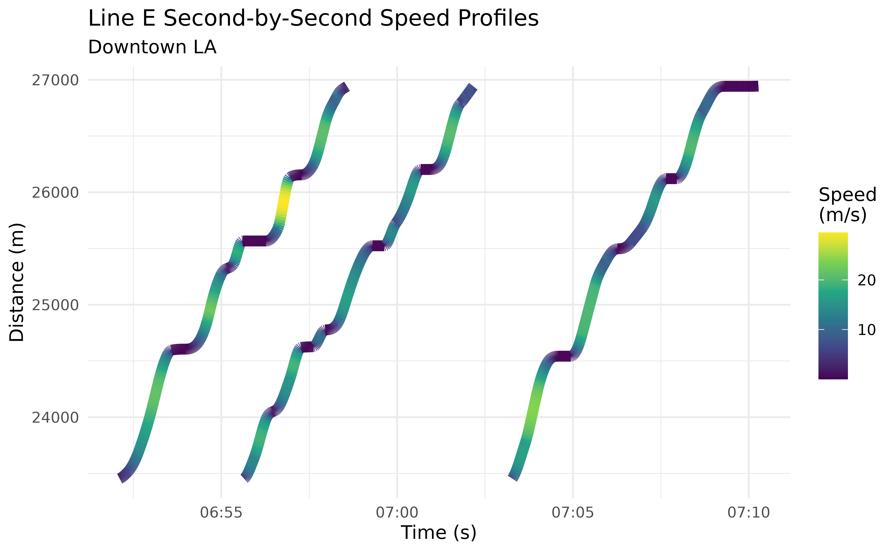
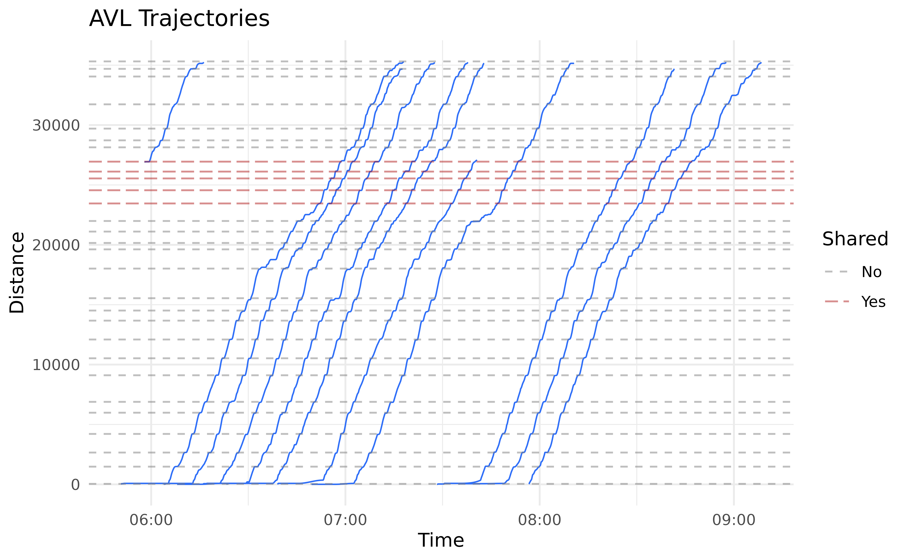
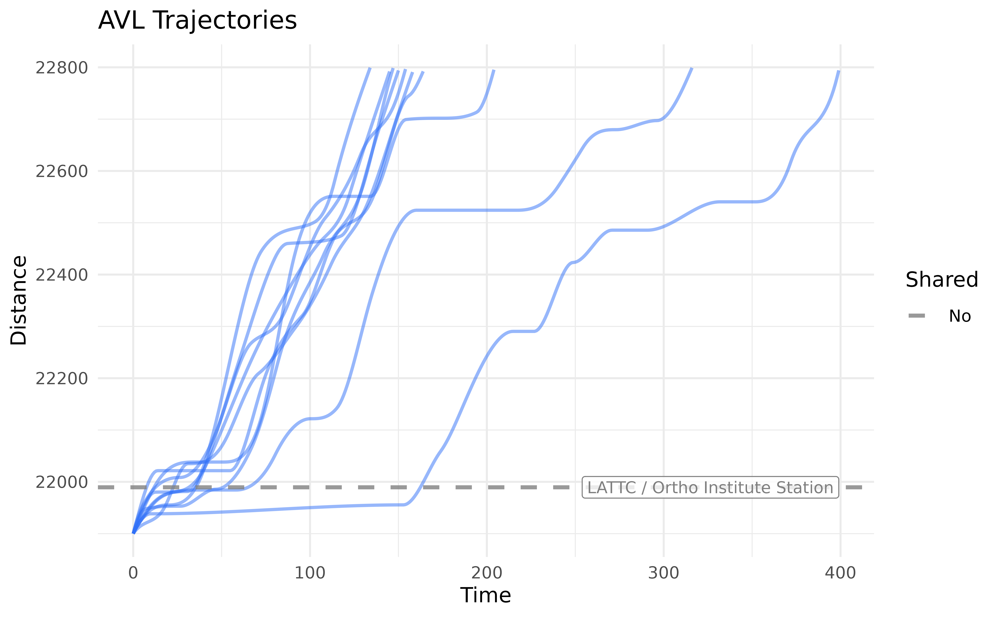

# Introduction to Trajectories

## Introduction

In the previous vignette
([`vignette("articles/data-workflow-la")`](https://obrien-ben.github.io/transittraj/articles/data-workflow-la.md)),
we saw how we can use `transittraj` to clean our AVL data. We took care
of outliers, deadheading trips, noise, and non-monotonic observations.
In this vignette, we’ll apply the cleaned data (`lineE_mono`) to fit a
trajectory function.

Let’s begin by loading the libraries we’ll be using:

``` r

library(transittraj)
library(tidytransit)
library(dplyr)
library(tidyr)
library(sf)
library(ggplot2)
```

## Fitting a Trajectory Curve

Our ultimate goal is to fit an interpolating curve describing the
position of a transit vehicle at any point in time. Ideally, we could
fit an inverse curve, giving us the time the transit vehicle passes any
point in space. We can do both using
[`get_trajectory_fun()`](https://obrien-ben.github.io/transittraj/reference/get_trajectory_fun.md).

`transittraj` supports a handful of methods for fitting these functions.
The simplest is linear interpolation without an inverse. For more
fine-grained analyses, though, we recommend fitting a *velocity-informed
piecewise cubic interpolating polynomial*. This uses the speeds and
distances, corrected for monotonicity, to fit a cubic spline between
each observation. This is the type of curve that
[`get_trajectory_fun()`](https://obrien-ben.github.io/transittraj/reference/get_trajectory_fun.md)
will fit by default (`interp_method = "monoH.FC"` and
`use_speeds = TRUE`).

Using the data we cleaned in the previous vignette, let’s fit our
trajectory functions:

``` r

# Run function
lineE_traj <- get_trajectory_fun(distance_df = lineE_mono,
                                interp_method = "monoH.FC",
                                use_speeds = TRUE,
                                find_inverse_fun = TRUE)
```

`transittraj` stores the fit curves in a special object class. This
object stores a list of fit trajectories, one for each trip, as well as
the time and distances ranges for each trip. We can use
[`summary()`](https://rdrr.io/r/base/summary.html) to take a look inside
the object:

``` r

summary(lineE_traj)
#> ------
#> AVL Group Trajectory Object
#> ------
#> Number of trips: 11
#> Total distance range: 0.6366599 to 35292.87
#> Total time range: 1779886240 to 1779898116
#> ------
#> Trajectory function present: TRUE
#>    --> Trajectory interpolation method: monoH.FC
#>    --> Maximum derivative: 3
#>    --> Fit with speeds: TRUE
#> Inverse function present: TRUE
#>    --> Inverse function tolerance: 0.01
#> ------
```

## Interpolating

How do you use the fit curve to actually interpolate at new points? We
recommend using [`predict()`](https://rdrr.io/r/stats/predict.html), as
this will ensure that the curves aren’t used to extrapolate beyond the
range of each trip. Using
[`predict()`](https://rdrr.io/r/stats/predict.html), there are three
main ways we can interpolate: retrieve distance values from times,
retrieve time values from distances, or retrieve time & distance pairs
over a spatial range.

### Interpolating for Distance from Time

Let’s say you want to know where every vehicle is at a certain point in
time. We can do that by providing `new_times` to
[`predict()`](https://rdrr.io/r/stats/predict.html). Let’s see below:

``` r

# Run interpolating function
lineE_time_interp <- predict(
  object = lineE_traj,
  new_times = c(1779887000, 1779887500)
)

# Print full results
print(lineE_time_interp)
#>   event_timestamp trip_id_performed deriv       interp
#> 1      1779887000          63383915     0    83.127539
#> 2      1779887000          63384093     0 28716.983901
#> 3      1779887500          63383915     0  3183.861194
#> 4      1779887500          63383917     0     7.874249
#> 5      1779887500          63383991     0    79.708636
#> 6      1779887500          63384093     0 34439.361240
```

Here, `interp` will be the distance in meters from the route’s
beginning, as indicated by the `deriv` column, which tells us the
derivative degree each row corresponds to. You’ll notice that, even
though we have 11 trips, there were only two to four distances for each
timepoint. This is because
[`predict()`](https://rdrr.io/r/stats/predict.html) will only
interpolate a distance value for trips that were actually running at
that point in time.

Using a similar function call, we can also find the speed of the vehicle
at any point in time by setting the `deriv` parameter in
[`predict()`](https://rdrr.io/r/stats/predict.html):

``` r

# Run interpolating function
lineE_speed_interp <- predict(
  object = lineE_traj,
  new_times = c(1779887000, 1779887500),
  deriv = 1
)

# Print results
print(lineE_speed_interp)
#> # A tibble: 6 × 4
#>   event_timestamp trip_id_performed deriv      interp
#>             <dbl> <chr>             <dbl>       <dbl>
#> 1      1779887000 63383915              1  0.00000355
#> 2      1779887000 63384093              1  3.06      
#> 3      1779887500 63383915              1 16.4       
#> 4      1779887500 63383917              1  0.0000517 
#> 5      1779887500 63383991              1  0.00000880
#> 6      1779887500 63384093              1 10.4
```

Here, `interp` will be the speed in meters per second. Finding speeds
requires starting from time values; we cannot get speeds from distance
values. Finally, if so desired, the input to `deriv` can be vectorized,
allowing you to calculate both position and speed (and acceleration, and
jerk!) with one function call:

``` r

# Run interpolating function
lineE_vec_interp <- predict(
  object = lineE_traj,
  new_times = c(1779887000, 1779887500),
  deriv = c(0, 1)
)

# Print results
print(lineE_vec_interp)
#> # A tibble: 12 × 4
#>    event_timestamp trip_id_performed deriv  interp
#>              <dbl> <chr>             <dbl>   <dbl>
#>  1      1779887000 63383915              0 8.31e+1
#>  2      1779887000 63383915              1 3.55e-6
#>  3      1779887000 63384093              0 2.87e+4
#>  4      1779887000 63384093              1 3.06e+0
#>  5      1779887500 63383915              0 3.18e+3
#>  6      1779887500 63383915              1 1.64e+1
#>  7      1779887500 63383917              0 7.87e+0
#>  8      1779887500 63383917              1 5.17e-5
#>  9      1779887500 63383991              0 7.97e+1
#> 10      1779887500 63383991              1 8.80e-6
#> 11      1779887500 63384093              0 3.44e+4
#> 12      1779887500 63384093              1 1.04e+1
```

### Interpolating for Time from Distance

One of the most common applications of the fit trajectory curve is to
find the time at which each vehicle passed a point along its route. To
do this, we’ll use [`predict()`](https://rdrr.io/r/stats/predict.html)
with the `new_distances` parameter. We’ll begin by finding the distance
of each stop along the route using
[`get_stop_distances()`](https://obrien-ben.github.io/transittraj/reference/get_stop_distances.md):

``` r

# First, find stop IDs served by Line A
lineA_stop_ids <- filter_by_route(gtfs = lacmta_gtfs,
                                  route_ids = "801")$stops %>%
  pull(stop_id)

# Next, find stop distances and join the timepoints column
lineE_stops <- get_stop_distances(gtfs = lineE_gtfs,
                                 shape_geometry = lineE_shape,
                                 project_crs = la_CRS) %>%
  # Find whether they are shared with Line A
  mutate(Shared = (stop_id %in% lineA_stop_ids),
         Shared = if_else(condition = Shared,
                          true = "Yes",
                          false = "No")) %>%
  # Polish up the result
  select(stop_id, stop_name, Shared, distance) %>%
  arrange(distance)

# Print header
head(lineE_stops)
#> # A tibble: 6 × 4
#>   stop_id stop_name                      Shared distance
#>   <chr>   <chr>                          <chr>     <dbl>
#> 1 80139   Downtown Santa Monica Station  No         41.2
#> 2 80138   17th Street / SMC Station      No       1479. 
#> 3 80137   26th Street / Bergamot Station No       2656. 
#> 4 80136   Expo / Bundy Station           No       4212. 
#> 5 80135   Expo / Sepulveda Station       No       5983. 
#> 6 80134   Westwood / Rancho Park Station No       6888.
```

Now that we have some distances, let’s interpolate using
[`predict()`](https://rdrr.io/r/stats/predict.html):

``` r

# Run interpolating function
lineE_stop_crossings <- predict(
  object = lineE_traj,
  new_distances = lineE_stops
)

# Print header
head(lineE_stop_crossings)
#> # A tibble: 6 × 6
#>   stop_id stop_name                     Shared distance trip_id_performed interp
#>   <chr>   <chr>                         <chr>     <dbl> <chr>              <dbl>
#> 1 80139   Downtown Santa Monica Station No         41.2 63383915          1.78e9
#> 2 80139   Downtown Santa Monica Station No         41.2 63383917          1.78e9
#> 3 80139   Downtown Santa Monica Station No         41.2 63383949          1.78e9
#> 4 80139   Downtown Santa Monica Station No         41.2 63383991          1.78e9
#> 5 80139   Downtown Santa Monica Station No         41.2 63384002          1.78e9
#> 6 80139   Downtown Santa Monica Station No         41.2 63384022          1.78e9
```

Now we have the crossing time, labeled `interp` at each stop for each
trip. The interpolated times are in seconds of epoch time. You’ll notice
that this preserves all other fields in the input `new_distances`
dataframe (including `stop_id`, `stop_name`, and `Shared`).

### Interpolating for Time & Distance Pairs Over a Range

The final interpolation method allows you to specify a range of
distances, and a timestep over which to interpolate within this range.
Here, `transittraj` will use your trajectory’s inverse function to find
the time each trip enters and exits the `distance_lims`, then
interpolate every `timestep` seconds that the vehicle stays in that
range.

To see what this does, let’s interpolate some timepoints for all trips
through downtown LA. We’ll begin by finding distances of the first and
last stop Line E shares with Line A:

``` r

# Get distance limits of U St between 13th and 14th
downtown_stops <- lineE_stops %>%
  filter(Shared == "Yes") %>%
  pull(distance)
downtown_lims <- c(min(downtown_stops),
                   max(downtown_stops))

print(downtown_lims)
#> [1] 23453.64 26944.68
```

Next, we can put this into
[`predict()`](https://rdrr.io/r/stats/predict.html) using the
`distance_lims` parameter, alongside a `timestep` of 1 second. As above,
we can vectorize the `deriv` input to find both position and speed at
each timestep:

``` r

# Run interpolating function
lineE_downtown_interp <- predict(
  object = lineE_traj,
  distance_lims = downtown_lims,
  timestep = 1,
  deriv = c(0, 1)
)

# Print header
head(lineE_downtown_interp)
#> # A tibble: 6 × 4
#>   trip_id_performed event_timestamp deriv   interp
#>   <chr>                       <dbl> <dbl>    <dbl>
#> 1 63383915              1779889926.     0 23454.  
#> 2 63383915              1779889926.     1     2.60
#> 3 63383915              1779889927.     0 23456.  
#> 4 63383915              1779889927.     1     2.89
#> 5 63383915              1779889928.     0 23459.  
#> 6 63383915              1779889928.     1     3.18
```

We can see that, for the printed trip, the first timepoint occurs at the
beginning of `downtown_lims`, then `event_timestamp` increments 1 second
per row afterwards. To better understand see what this did, we’ll
generate a plot of these generated points. Below, we first “pivot” our
interpolated dataframe to make separate columns for distance and speed
interpolations (`interp_0` and `interp_1`, respectively):

``` r

# Pivot, for seprate columns for dist & speed
lineE_downtown_pivot <- lineE_downtown_interp %>%
  # Order by time, then filter to the first three complete
  arrange(event_timestamp) %>%
  filter(trip_id_performed %in% unique(trip_id_performed)[2:4]) %>%
  # Pivot to make distance & speed separate columns
  pivot_wider(id_cols = c("trip_id_performed", "event_timestamp"),
              names_from = "deriv", names_glue = "interp_{.name}",
              values_from = "interp") %>%
  # Convert to timezone
  mutate(event_timestamp = as.POSIXct(event_timestamp,
                                      tz = "America/Los_Angeles"))

head(lineE_downtown_pivot)
#> # A tibble: 6 × 4
#>   trip_id_performed event_timestamp     interp_0 interp_1
#>   <chr>             <dttm>                 <dbl>    <dbl>
#> 1 63383915          2026-05-27 06:52:06   23454.     2.60
#> 2 63383915          2026-05-27 06:52:07   23456.     2.89
#> 3 63383915          2026-05-27 06:52:08   23459.     3.18
#> 4 63383915          2026-05-27 06:52:09   23463.     3.45
#> 5 63383915          2026-05-27 06:52:10   23466.     3.71
#> 6 63383915          2026-05-27 06:52:11   23470.     3.96
```

Next, we’ll draw these points as trajectory lines, with the distance
column `interp_0` used for the y-axis, and the speed column `interp_1`
used to apply a color gradient:

``` r

# Create plot
downtown_plot <- ggplot(data = lineE_downtown_pivot) +
  # Add points
  geom_line(aes(group = trip_id_performed,
                x = event_timestamp,
                y = interp_0, # y from interp at deriv 0, i.e. distnace
                color = interp_1), # color from interp at deriv 1, i.e. speed
             linewidth = 3, alpha = 1) +
  # Color points by trip
  scale_color_viridis_c(name = "Speed\n(m/s)") +
  # Theming
  theme_minimal() +
  labs(x = "Time (s)",
       y = "Distance (m)",
       title = "Line E Second-by-Second Speed Profiles",
       subtitle = "Downtown LA")
downtown_plot
```



Through this use of [`predict()`](https://rdrr.io/r/stats/predict.html),
it becomes very easy to identify individual stop-and-go cycles through
regions of interest.

You could retrieve identical results by giving
[`predict()`](https://rdrr.io/r/stats/predict.html) a `new_times`
sequence spanning the range of the trajectory’s `event_timestamp`’s,
then filtering to the desired distance range. For large datasets –
spanning, for example, months –, however, this would require a *massive*
sequence. If an inverse function is available, using `distance_lims` and
`timestep` is a much more efficient way to generate high-resolution
trajectory profiles for a large number of trips, especially if you are
interested in studying a specific region in space.

## Visualizing Trajectories

### Quick Plots

Now its time for the fun part – plotting our trajectory curves. We can
use [`plot()`](https://rdrr.io/r/graphics/plot.default.html) to easily
generate a plot of all trajectories:

``` r

plot(lineE_traj)
```



[`plot()`](https://rdrr.io/r/graphics/plot.default.html) is intended for
quick visualizations of trajectories, and as such does not allow for
much customization. In the next section, we’ll use
[`plot_trajectory()`](https://obrien-ben.github.io/transittraj/reference/plot_trajectory.md)
to create more interesting plots.

### Detailed Trajectories

For more customization, we recommend using
[`plot_trajectory()`](https://obrien-ben.github.io/transittraj/reference/plot_trajectory.md).
In addition to a trajectory object, you can add a dataframe of feature
distances, such as the `lineE_stops` dataframe we made earlier. Most
layer aesthetics can be controlled using input parameters. For features
and trajectories, the linetypes and colors can also be mapped to
attributes of that specific layer using a dataframe:

``` r

# Set formatting options for Line E stops
stop_formatting <- data.frame(Shared = c("Yes", "No"),
                              color = c("firebrick", "grey50"),
                              linetype = c("longdash", "dashed"))
```

For mapping dataframes, at least one column must match a column in the
layer being mapped to. The other columns must be `color` and/or
`linetype`, telling `transittraj` which feature they describe.

We can plug all that in to
[`plot_trajectory()`](https://obrien-ben.github.io/transittraj/reference/plot_trajectory.md)
to generate our formatted plot:

``` r

# Run plotting function
traj_plot <- plot_trajectory(
  # Provide input data
  trajectory = lineE_traj,
  feature_distances = lineE_stops,
  # Format features
  feature_color = stop_formatting,
  feature_type = stop_formatting,
  feature_width = 0.5, feature_alpha = 0.5,
  # Format trajectories
  traj_color = "#2f6ff8",
  traj_width = 0.4, traj_alpha = 1
)
traj_plot
```


It’s hard to see what’s actually going on here. The benefits of the
cleaning we did, and of fitting a spline trajectory, become much more
apparent when we zoom in. Below we use the `distance_lim` parameter to
zoom into a stretch of track between LATCC and Pico Station. This
section has a handful of tightly-spaced intersections, including Flower
St & Washington Blvd, where Line E joins Line A.

We’ll use two additional plotting parameters here. First,
`center_trajectories` will center each trajectory to start at the same
point in time. Second, `label_field` will create a label on our feature
lines using the specified field from `lineE_stops`.

``` r

# Set parameters
flower_st_lims <- c(21900, 22800)

# Run function
flower_st_plot <- plot_trajectory(
  # Provide input data
  trajectory = lineE_traj,
  feature_distances = lineE_stops,
  center_trajectories = TRUE,
  distance_lim = flower_st_lims,
  timestep = 1,
  # Format fetures
  feature_color = stop_formatting,
  feature_type = stop_formatting,
  feature_width = 1, feature_alpha = 0.8,
  # Format trajectories
  traj_width = 0.8, traj_alpha = 0.5, traj_color = "#2f6ff8",
  # Add labels
  label_field = "stop_name", label_pos = "right",
  label_alpha = 0.8
)
flower_st_plot
```



We can glean some insights from this. Every trip stops at LATTC’s
station. The Flower & Washington intersection, where Line A joins Line
E, is located roughly at 22,550 meters. We can see that most trips come
to a stop near this intersection as well. A handful of trips stop or
slow down for the other, smaller signals up- or down-stream of Flower &
Washington.

Check out
[`help(plot_trajectory)`](https://obrien-ben.github.io/transittraj/reference/plot_trajectory.md)
for a full discussion of the formatting features available.

### Line Animations

Another fun way to visualize transit vehicle trajectories is to animate
them. Use
[`plot_animated_line()`](https://obrien-ben.github.io/transittraj/reference/plot_animated_line.md)
to animate vehicles, as points, moving along a straight line.

The formatting process works very similarly with
[`plot_animated_line()`](https://obrien-ben.github.io/transittraj/reference/plot_animated_line.md)
as it does with
[`plot_trajectory()`](https://obrien-ben.github.io/transittraj/reference/plot_trajectory.md).
A dataframe can be used to map the `outline` color and `shape`
attributes of stop and vehicle points to their attributes.

``` r

# Set parameters
stop_formatting <- data.frame(Shared = c("Yes", "No"),
                              outline = c("firebrick4", "grey30"),
                              shape = c(22, 21))
```

For this plot, we’ll zoom in to the Florida Ave-U St corridor of the
route. Now we can generate our line animation:

``` r

# Set distance limits
downtown_lims <- c(20500, 29000)

# Run function
line_anim <- plot_animated_line(
  # Add input data
  trajectory = lineE_traj,
  feature_distances = lineE_stops,
  distance_lim = downtown_lims,
  timestep = 1,
  # Format vehicles
  veh_outline = "#2f6ff8", veh_stroke = 2,
  # Format features
  feature_outline = stop_formatting,
  feature_shape = stop_formatting,
  feature_size = 4, feature_stroke = 1.5,
  # Add labels
  label_field = "stop_name",
  label_pos = "right", label_size = 3,
  # Format route & vehicles
  route_color = "#f43155",
  veh_alpha = 0.9, veh_size = 4
)
line_anim
```

# An error occurred.

Unable to execute JavaScript.

The animation shows us that most trips stop primarily at their stations,
usually only briefly. There are, though, occasional slow downs between
stations, most commonly between LATTC and Pico (as we saw in the
trajectory plot above). Through the rest of dowtown, movements seem to
be smoother.

You’ll also notice that we’ve uploaded this animation to YouTube and
embedded it in the vignette. We did this so we could produce a smooth,
high-resolution video that doesn’t need to be re-rendered every time
this vignette is built. By default, `transittraj`’s animation functions
will return a `gif`. Check out
[`gganimate::animate()`](https://gganimate.com/reference/animate.html)
for options to render videos.

### Map Animations

The final visualization we’ll make is an animated map. The concept is
similar to the animated line we saw above, but instead of simplifying
the route, we’ll draw it spatially and show the vehicles traveling
through the city.

The function
[`plot_animated_map()`](https://obrien-ben.github.io/transittraj/reference/plot_animated_line.md)
has formatting and feature options very similar to the previous two
visualization functions. We can reuse the formatting options from
[`plot_animated_line()`](https://obrien-ben.github.io/transittraj/reference/plot_animated_line.md)
here.

``` r

# Run function
map_anim <- plot_animated_map(
  # Add trajectory, shape, & feature data
  trajectory = lineE_traj,
  shape_geometry = lineE_shape,
  feature_distances = lineE_stops,
  # Format features
  feature_outline = stop_formatting,
  feature_shape = stop_formatting,
  feature_size = 4, feature_stroke = 3,
  # Format route
  route_color = "#f43155", route_width = 4,
  bbox_expand = 1000,
  # Format vehicles
  veh_size = 6, veh_stroke = 3,
  veh_outline = "#2f6ff8", veh_alpha = 0.9
)
map_anim
```

# An error occurred.

Unable to execute JavaScript.

These animations help give additional spatial context to some patterns
noticed earlier. Many slowdowns between stations that were visible in
the trajectories now clearly occur at intersections. For example, a
particularly long delay at Flower & Washington – just south of the I-10
freeway – is visible at around 0:34. We can also see some potential
bunching: two trains get fairly close on Exposition Blvd, just southwest
of downtown, at around 0:14. They stay close through downtown, and
finish their trips only a ~3 minutes apart at 0:25. If one wanted to
zoom into a specific region, `distance_lims` can be used just as before.

## Conclusion

In this vignette we saw how we can easily fit an interpolating
trajectory curve to our cleaned AVL data. We used this to interpolate
for new time, distance, and speed points along the route. We also
explored some ways we can plot and visualize the trajectories. Future
vignettes
([`vignette("articles/indygo-signals")`](https://obrien-ben.github.io/transittraj/articles/indygo-signals.md))
will explore real-world applications of trajectories.
