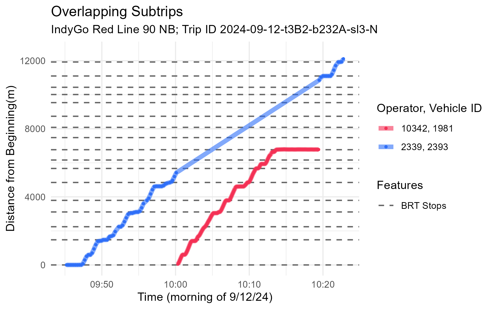
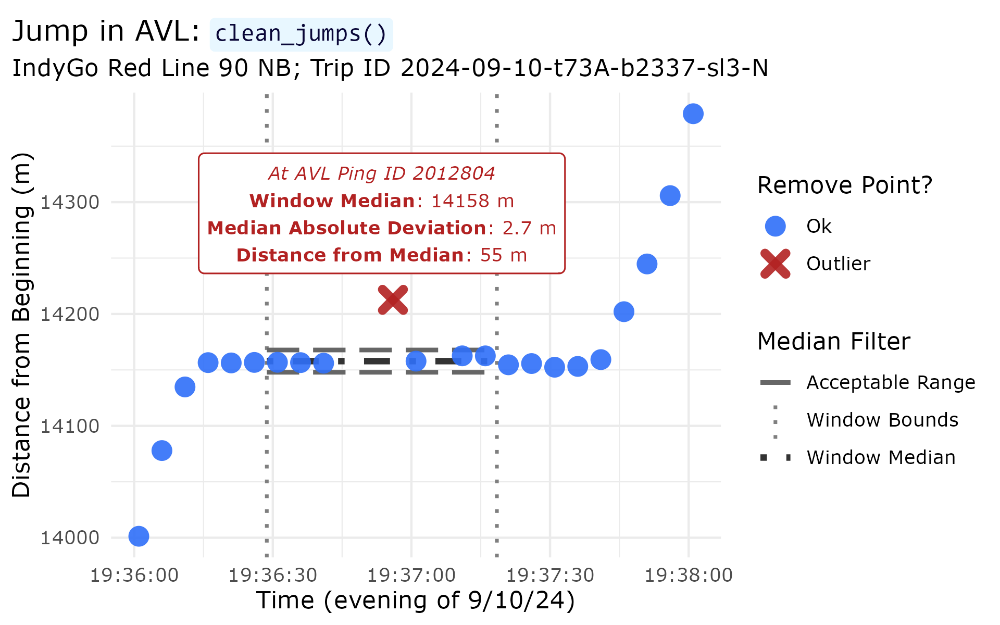
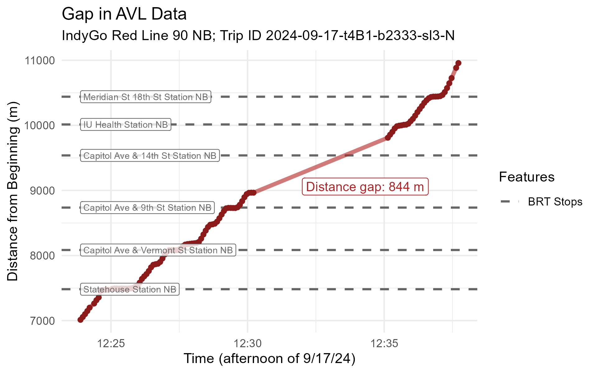
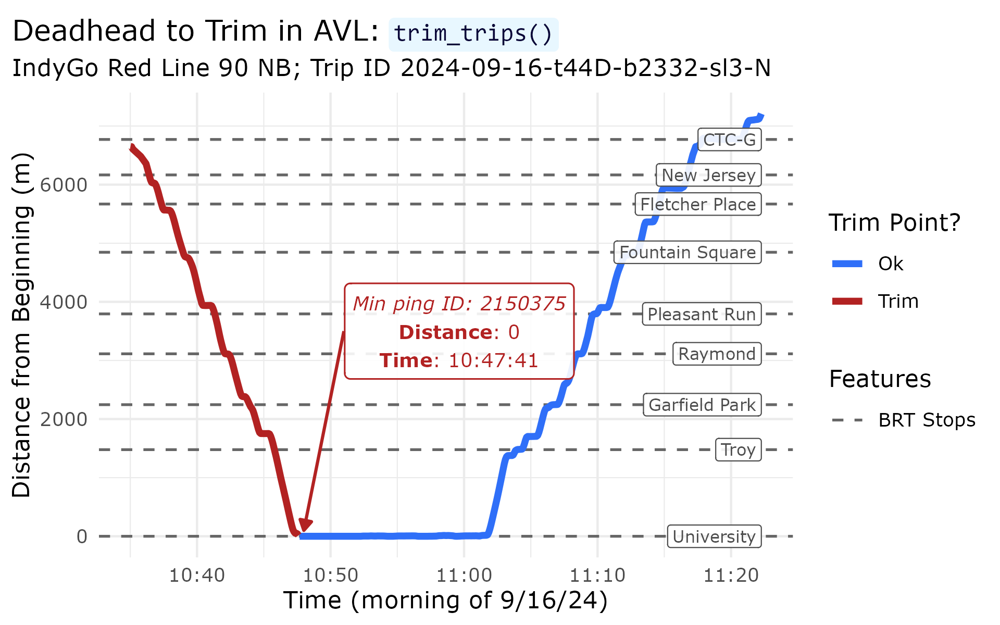
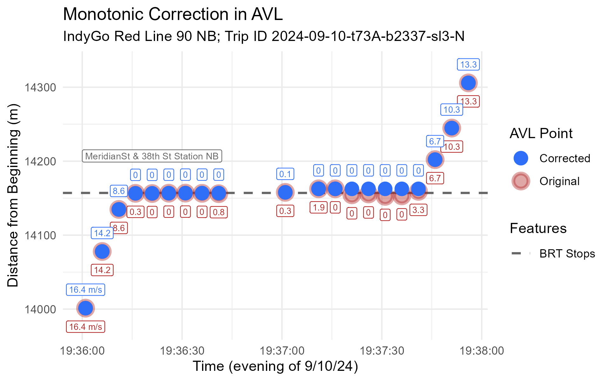
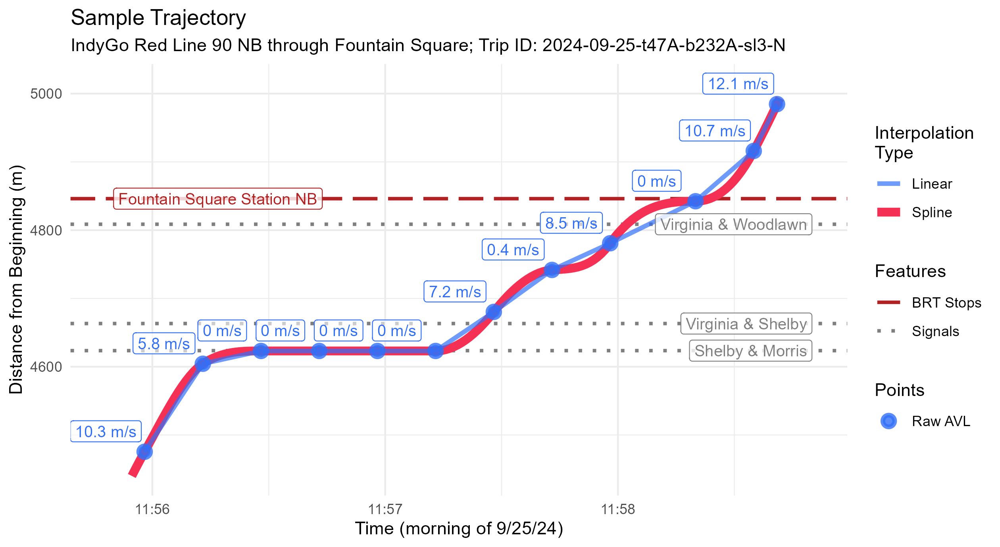
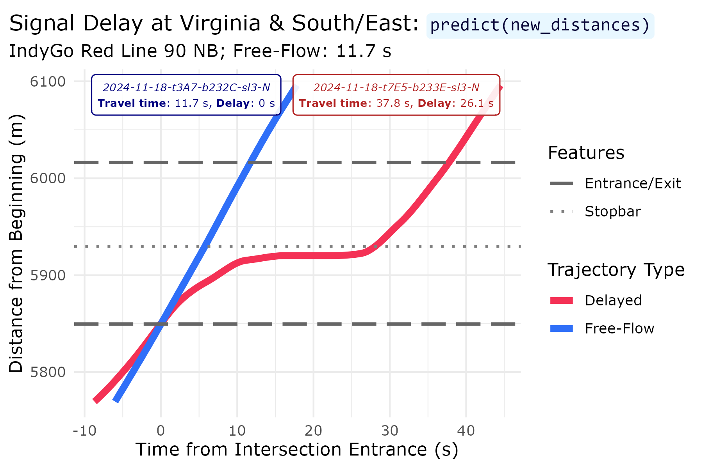
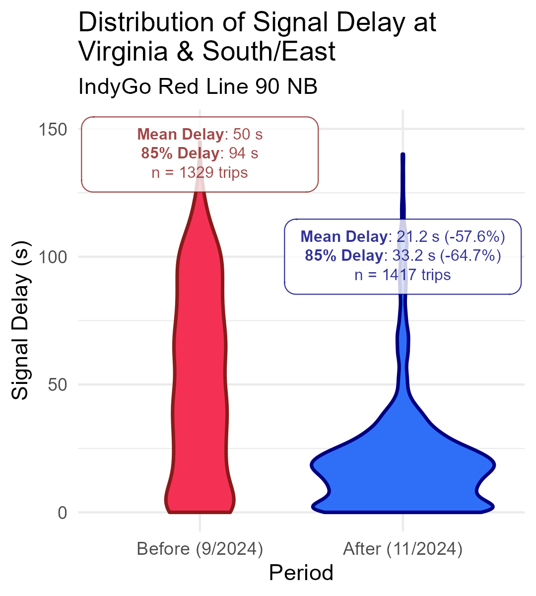
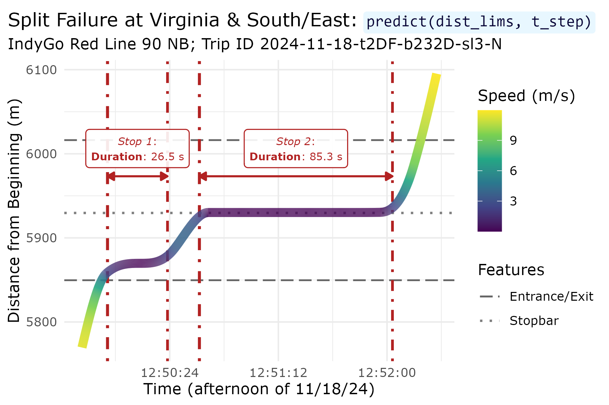
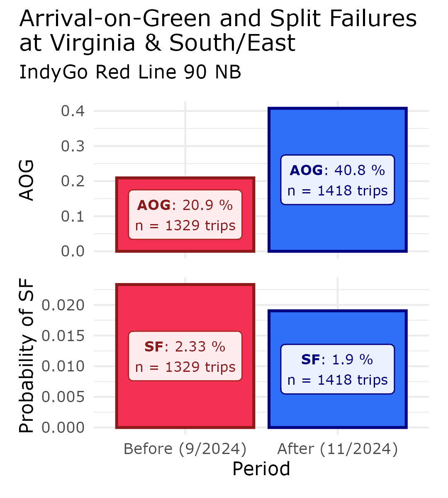

# Introduction

Thanks for checking out `transittraj`! This article contains all code that
produced the figures and stats on our poster at Transport Chicago 2026.
As this is intended to supplement the poster presentation, we will only
minimally discuss our code here. If you have additional questions, feel free
to contact us:

  - Ben O'Brien: beno3@illinois.edu

  - Lewis Lehe: lehe@illinois.edu

# Setup

The data we used here was shared with is privately by IndyGo
via their Swiftly API endpoint. As such, we unfortunately cannot share the
raw AVL data. We've pre-loaded the following IndyGo data into our RStudio
workspace before running this vignette:

  - `avl_df`: The TIDES-compliant `vehicle_locations.csv` table of historic AVL data. This includes all northbound Red Line (90N) trips made on weekdays in September and November 2024.

  - `route_geom`: The Red Line's northbound alignment, as retrieved from IndyGo's GTFS via `transittraj::get_shape_geometry()`.

  - `stops`: The distance of each northbound Red Line stop along its alignment, as retrieved from IndyGo's GTFS via `transittraj::get_stop_distances()`.

  - `signals` and `signal_boundings`: The distance of each northbound signal stopbar and entrance-exit analysis zone, respectively. These were identified using OpenStreetMap data and Google Earth satellite imagery, then projected onto the route via `transittraj::project_onto_route()`.

With this, we can load the packages we'll need:


``` r
# For analysis:
devtools::load_all() # library(transittraj)
library(tidyverse)

# For plotting:
library(marquee)
library(patchwork)
```

And we can set the parameters we'll use for our data cleaning. Throughout the cleaning process, we'll reference these names variables, rather than using numeric values.


``` r
# - Cleaning parameters -
indy_crs <- 32616 # WGS 84 UTM Zone 16N
route_buffer = 50 # meters
min_dist = 200 # meters
min_dur = 90 # seconds
dist_error = 0.00001 # meters
max_d_gap = 800 # meters
hampel_t = 2.5
```

# Proposed Workflow


## Steps 1 & 2: Buffer & Project onto Route

Steps 1 and 2 share the same function, `get_linear_distances()`, as they both require geospatial analysis. There's no need for the user to engage with spatial data, though, as long as your input TIDES table (`avl_df`) has the appropriate `latitude` and `longitude` numeric columns.


``` r
# Get initial dims
n_obs <- dim(avl_df)[1]
n_trips <- length(unique(avl_df$trip_id_performed))

# - Step 1 & 2: Buffer & Linearize -
t_0 <- Sys.time()
distance_df <- get_linear_distances(avl_df = avl_df,
                                    shape_geometry = route_geom,
                                    clip_buffer = route_buffer,
                                    project_crs = indy_crs) %>%
  filter(distance < 20500) %>%
  mutate(operator_id = as.character(operator_id))
t_f <- Sys.time()

# Save changes
dur <- c(NA,
         as.numeric(difftime(t_f, t_0, units = "secs")))
n_obs <- append(n_obs,
                dim(distance_df)[1])
n_trips <- append(n_trips,
                  length(unique(distance_df$trip_id_performed)))
```

## Step 3: Remove Overlapping Subtrips

First, run the step:


``` r
# - Step 3: Remove Overlap Subtrips -
t_0 <- Sys.time()
step3_df <- clean_overlapping_subtrips(distance_df = distance_df,
                                       check_operator = TRUE,
                                       return_removals = FALSE)
t_f <- Sys.time()

# Save changes
dur <- append(dur,
              as.numeric(difftime(t_f, t_0, units = "secs")))
n_obs <- append(n_obs,
                dim(step3_df)[1])
n_trips <- append(n_trips,
                  length(unique(step3_df$trip_id_performed)))
```

Next, plot our example:


``` r
plot_trip <- "2024-09-12-t3B2-b232A-sl3-N"
plot_df <- distance_df %>%
  filter(trip_id_performed == plot_trip) %>%
  mutate(subtrip_id = paste(trip_id_performed, operator_id, vehicle_id,
                            sep = "-"),
         op_veh = paste(operator_id, vehicle_id, sep = ", "))

step3_plot <- ggplot(data = plot_df) +
  geom_hline(data = stops,
             aes(yintercept = distance, linetype = "BRT Stops"),
             color = "grey40", linewidth = 0.4) +
  geom_line(aes(x = event_timestamp, y = distance, color = op_veh),
            linewidth = 2, alpha = 0.6) +
  geom_point(aes(x = event_timestamp, y = distance, color = op_veh),
            size = 0.8, alpha = 1) +
  scale_color_manual(name = "Operator,\nVehicle ID",
                     values = c("10342, 1981" = "#f43155",
                                "2339, 2393" = "#2f6ff8")) +
  scale_linetype_manual(name = "Features",
                        values = c("BRT Stops" = "dashed")) +
  ylim(c(0, 12500)) +
  xlim(c(as.POSIXct("2024-09-12 09:45:00", tz = "America/New_York"),
         as.POSIXct("2024-09-12 10:23:00", tz = "America/New_York"))) +
  theme_minimal() +
  labs(x = "Time (morning of 9/12/24)",
       y = "Distance from Beginning(m)",
       title = "Sub-Trips in AVL: `clean_overlapping_subtrips()`",
       subtitle = paste("IndyGo Red Line 90 NB; Trip ID ", plot_trip,
                        sep = "")) +
  theme(text = element_text(family = "Verdana"),
        plot.title = element_marquee(style = code_style),
        plot.title.position = "plot")
step3_plot
```




## Step 4: Remove Outlying Jumps

First, run the step:


``` r
# - Step 4: Remove jumps -
t_0 <- Sys.time()
step4_df <- clean_jumps(distance_df = step3_df,
                        t_cutoff = hampel_t)
t_f <- Sys.time()

# Save changes
dur <- append(dur,
              as.numeric(difftime(t_f, t_0, units = "secs")))
n_obs <- append(n_obs,
                dim(step4_df)[1])
n_trips <- append(n_trips,
                  length(unique(step4_df$trip_id_performed)))
```

Next, plot our example:


``` r
outliers <- clean_jumps(distance_df = step3_df,
                         t_cutoff = hampel_t,
                         return_removals = TRUE)
plot_trip <- "2024-09-10-t73A-b2337-sl3-N"
plot_df <- step3_df %>%
  filter(trip_id_performed == plot_trip) %>%
  filter((distance >= 14000) & (distance <= 14380)) %>%
  select(event_timestamp, distance, location_ping_id) %>%
  mutate(point_ok = if_else(condition = (location_ping_id %in% outliers$location_ping_id),
                            true = "Outlier",
                            false = "Ok"))
window_bounds <- data.frame(x = c(as.POSIXct("2024-09-10 19:36:28.7", tz = "America/New_York"),
                                  as.POSIXct("2024-09-10 19:37:18.5", tz = "America/New_York")),
                            med = c(14157.86, 14157.86)) %>%
  mutate(upr = med + (hampel_t * 2.69 * 1.48),
         lwr = med - (hampel_t * 2.69 * 1.48))
lab_df <- data.frame(y = 14290,
                     x = mean(window_bounds$x),
                     lab = paste("*At AVL Ping ID 2012804*",
                                 "**Window Median**: 14158 m",
                                 "**Median Absolute Deviation**: 2.7 m",
                                 "**Distance from Median**: 55 m",
                                 sep = "  \n"))
step4_plot <- ggplot(data = plot_df) +
  geom_vline(data = window_bounds,
             aes(xintercept = x, linetype = "Window Bounds"),
             color = "grey50", linewidth = 0.8) +
  geom_line(data = window_bounds,
            aes(x = x, y = med, linetype = "Window Median"),
            color = "grey20", linewidth = 1.4) +
  geom_line(data = window_bounds,
            aes(x = x, y = lwr, linetype = "Acceptable Range"),
            color = "grey40", linewidth = 1) +
  geom_line(data = window_bounds,
            aes(x = x, y = upr, linetype = "Acceptable Range"),
            color = "grey40", linewidth = 1) +
  geom_point(aes(x = event_timestamp, y = distance,
                 color = point_ok, shape = point_ok),
             size = 2.5, stroke = 3, alpha = 0.9) +
  scale_color_manual(name = "Remove Point?",
                     values = c("Outlier" = "firebrick",
                                "Ok" = "#2f6ff8")) +
  scale_shape_manual(name = "Remove Point?",
                     values = c("Outlier" = 4,
                                "Ok" = 16)) +
  scale_linetype_manual(name = "Median Filter",
                        values = c("Window Bounds" = "dotted",
                                   "Window Median" = "dotdash",
                                   "Acceptable Range" = "longdash")) +
  geom_marquee(data = lab_df,
               aes(x = x, y = y, label = lab),
               color = "firebrick", size = 3, hjust = 0.5,
               style = lab_firebrick, fill = "white", alpha = 1,
               family = "Verdana") +
  theme_minimal() +
  labs(x = "Time (evening of 9/10/24)",
       y = "Distance from Beginning (m)",
       title = "Jump in AVL: `clean_jumps()`",
       subtitle = paste("IndyGo Red Line 90 NB; Trip ID ", plot_trip,
                        sep = "")) +
  theme(text = element_text(family = "Verdana"),
        plot.title = element_marquee(style = code_style),
        plot.title.position = "plot")
step4_plot
```




## Step 5: Remove Insufficient Trips

First, run the step:


``` r
# - Step 5: Clean insufficient trips -
t_0 <- Sys.time()
step5_df <- clean_incomplete_trips(distance_df = step4_df,
                                   min_trip_distance = min_dist,
                                   min_trip_duration = min_dur,
                                   max_distance_gap = max_d_gap)
t_f <- Sys.time()

# Save changes
dur <- append(dur,
              as.numeric(difftime(t_f, t_0, units = "secs")))
n_obs <- append(n_obs,
                dim(step5_df)[1])
n_trips <- append(n_trips,
                  length(unique(step5_df$trip_id_performed)))
```

Next, plot our example:


``` r
plot_trip <- "2024-09-17-t4B1-b2333-sl3-N"
plot_df <- step4_df %>%
  filter(trip_id_performed == plot_trip) %>%
  filter((distance >= 7000) & (distance <= 11000))
lab_df <- data.frame(lab = "**Distance gap**: 844 m",
                     y = 9060,
                     x = as.POSIXct("2024-09-17 12:32:00", tz = "America/New_York"))

step5_plot <- ggplot(data = plot_df) +
  geom_hline(data = (stops %>% filter((distance >= 7000) & (distance <= 11000))),
             aes(yintercept = distance, linetype = "BRT Stops"),
             color = "grey40", linewidth = 0.6) +
  geom_line(aes(x = event_timestamp, y = distance),
            linewidth = 1.5, color = "firebrick", alpha = 0.6) +
  geom_point(aes(x = event_timestamp, y = distance),
             size = 1.5, color = "firebrick4") +
  geom_label(data = (stops %>% filter((distance >= 7000) & (distance <= 11000))),
             aes(x = plot_df$event_timestamp[1], y = distance, label = stop_name),
             hjust = "left", nudge_y = 0, size = 2.8, color = "grey30", alpha = 0.9,
             family = "Verdana") +
  geom_marquee(data = lab_df,
               aes(x = x, y = y, label = lab),
               hjust = 0, color = "firebrick", size = 3.6, fill = "#FFFFFFE6",
               family = "Verdana", style = lab_firebrick) +
  scale_linetype_manual(name = "Features",
                        values = c("BRT Stops" = "dashed")) +
  theme_minimal() +
  labs(x = "Time (afternoon of 9/17/24)",
       y = "Distance from Beginning (m)",
       title = "Gap in AVL: `clean_incomplete_trips()`",
       subtitle = paste("IndyGo Red Line 90 NB; Trip ID ", plot_trip,
                        sep = "")) +
  theme(text = element_text(family = "Verdana"),
        plot.title = element_marquee(style = code_style),
        plot.title.position = "plot")
step5_plot
```




## Step 6: Trip Trip Tails

First, run the step:


``` r
# - Step 6: Trim trip tails -
t_0 <- Sys.time()
step6_df <- trim_trips(distance_df = step5_df,
                       trim_type = "both")
#> Warning in trim_trips(distance_df = step5_df, trim_type = "both"): Trips found with maximum at or before minimum point -- potential wrong direction.
#> Removing the following: 2024-09-19-t407-b232F-sl3-N
t_f <- Sys.time()

# Save changes
dur <- append(dur,
              as.numeric(difftime(t_f, t_0, units = "secs")))
n_obs <- append(n_obs,
                dim(step6_df)[1])
n_trips <- append(n_trips,
                  length(unique(step6_df$trip_id_performed)))
```

Next, plot our example:


``` r
trimmed <- trim_trips(distance_df = step5_df,
                      trim_type = "both",
                      return_removals = TRUE)
plot_trip <- "2024-09-16-t44D-b2332-sl3-N"
plot_df <- step5_df %>%
  filter(trip_id_performed == plot_trip) %>%
  filter(distance < 7250) %>%
  mutate(point_ok = if_else(condition = (location_ping_id %in% trimmed$location_ping_id),
                            true = "Trim",
                            false = "Ok"))
lab_df <- plot_df %>%
  filter(point_ok == "Ok") %>%
  filter(location_ping_id == first(location_ping_id)) %>%
  select(location_ping_id, event_timestamp, distance) %>%
  mutate(lab = paste("*Min ping ID: ", location_ping_id, "*",
                     "  \n**Distance**: ", distance,
                     "  \n**Time**: ", strftime(event_timestamp,
                                                format = "%H:%M:%S",
                                                tz = "America/New_York"),
                     sep = ""),
         x1 = as.POSIXct("2024-09-16 10:51:00",
                         tz = "America/New_York"),
         x2 = as.POSIXct("2024-09-16 10:48:00",
                         tz = "America/New_York"),
         y1 = 3500,
         y2 = distance + 100) %>%
  select(-c(location_ping_id, event_timestamp, distance))


  data.frame(lab = paste("*Minimum ping ID: ", locat
                                 sep = ""),
                     x = as.POSIXct("2024-09-16 10:5:37", tz = "America/New_York"),
                     y = 750)
step6_plot <- ggplot(data = plot_df) +
  geom_hline(data = (stops %>% filter(distance <= 7250)),
             aes(yintercept = distance, linetype = "BRT Stops"),
             color = "grey40", linewidth = 0.6) +
  geom_line(aes(x = event_timestamp, y = distance, color = point_ok),
            linewidth = 1.5) +
  scale_color_manual(name = "Trim Point?",
                     values = c("Trim" = "firebrick",
                                "Ok" = "#2f6ff8")) +
  geom_label(data = (stops %>% filter((distance <= 7250))),
             aes(x = max(plot_df$event_timestamp), y = distance, label = stop_name),
             hjust = "right", size = 2.7, color = "grey30", alpha = 0.9,
             family = "Verdana") +
  geom_marquee(data = lab_df,
               aes(x = x1, y = y1, label = lab),
               hjust = 0, color = "firebrick", size = 3.1, fill = "#FFFFFFE6",
               family = "Verdana", style = lab_firebrick) +
  geom_segment(data = lab_df,
               aes(x = x1, xend = x2,
                   y = y1, yend = y2),
               arrow = arrow(ends = "last", type = "closed",
                             length = unit(0.025, units = "npc")),
               color = "firebrick", linetype = "solid", linewidth = 0.7) +
  scale_linetype_manual(name = "Features",
                        values = c("BRT Stops" = "dashed")) +
  theme_minimal() +
  labs(title = "Deadhead to Trim in AVL: `trim_trips()`",
       subtitle = paste("IndyGo Red Line 90 NB; Trip ID ", plot_trip,
                        sep = ""),
       x = "Time (morning of 9/16/24)",
       y = "Distance from Beginning (m)") +
  theme(text = element_text(family = "Verdana"),
        plot.title = element_marquee(style = code_style),
        plot.title.position = "plot")
step6_plot
```




## Step 7: Correct Monotonicity

First, run the step:


``` r
# - Step 7: Correct monotonicty -
t_0 <- Sys.time()
step7_df <- make_monotonic(distance_df = step6_df,
                           correct_speed = TRUE,
                           add_distance_error = dist_error)
t_f <- Sys.time()

# Save changes
dur <- append(dur,
              as.numeric(difftime(t_f, t_0, units = "secs")))
n_obs <- append(n_obs,
                dim(step7_df)[1])
n_trips <- append(n_trips,
                  length(unique(step7_df$trip_id_performed)))
```

Next, plot our example:


``` r
plot_trip <- "2024-09-10-t73A-b2337-sl3-N"
plot_df1 <- step6_df %>%
  filter(trip_id_performed == plot_trip) %>%
  filter((distance >= 14000) & (distance <= 14320)) %>%
  mutate(speed_lab = if_else(condition = (distance == min(distance)),
                             true = paste(round(speed, 1), " m/s", sep = ""),
                             false = paste(round(speed, 1))))
plot_df2 <- step7_df %>%
  filter(trip_id_performed == plot_trip) %>%
  filter((distance >= 14000) & (distance <= 14320)) %>%
  mutate(speed_lab = if_else(condition = (distance == min(distance)),
                             true = paste(round(speed, 1), " m/s", sep = ""),
                             false = paste(round(speed, 1))))

step7_plot <- ggplot(data = plot_df1) +
  geom_hline(data = (stops %>% filter((distance >= 14000) & (distance <= 14320))),
             aes(yintercept = distance, linetype = "BRT Stops"),
             color = "grey40", linewidth = 0.8) +
  geom_point(aes(x = event_timestamp, y = distance,
                 color = "Original", fill = "Original"),
             size = 4, stroke = 2, alpha = 0.4, shape = 21) +
  geom_point(data = plot_df2,
             aes(x = event_timestamp, y = distance,
                 color = "Corrected", fill = "Corrected"),
             size = 2.3, stroke = 2, alpha = 1, shape = 21) +
  geom_label(aes(x = event_timestamp, y = distance,
                 color = "Original", label = speed_lab),
             nudge_y = -25, size = 2, alpha = 0.9, show.legend = FALSE,
             family = "Verdana") +
  geom_label(data = plot_df2,
             aes(x = event_timestamp, y = distance,
                 color = "Corrected", label = speed_lab),
             nudge_y = 25, size = 2, alpha = 0.9, show.legend = FALSE,
             family = "Verdana") +
  geom_segment(aes(x = as.POSIXct("2024-09-10 19:36:05",
                                  tz = "America/New_York"),
                   xend = as.POSIXct("2024-09-10 19:36:00",
                                     tz = "America/New_York"),
                   y = 14217, yend = 14157),
               arrow = arrow(ends = "last", type = "closed",
                             length = unit(0.025, units = "npc")),
               color = "grey30", linetype = "solid", linewidth = 0.7) +
  geom_label(data = (stops %>% filter((distance >= 14000) & (distance <= 14320))),
             aes(x = as.POSIXct("2024-09-10 19:36:05", tz = "America/New_York"),
                 y = 14157, label = stop_name),
             color = "grey30", size = 3, alpha = 0.9, hjust = "left",
             nudge_y = 60, family = "Verdana") +
  scale_color_manual(name = "AVL Point",
                     values = c("Original" = "firebrick",
                                "Corrected" = "#2f6ff8")) +
  scale_fill_manual(name = "AVL Point",
                     values = c("Original" = "firebrick",
                                "Corrected" = "#2f6ff8")) +
  scale_linetype_manual(name = "Features",
                        values = c("BRT Stops" = "dashed")) +
  theme_minimal() +
  labs(x = "Time (evening of 9/10/24)",
       y = "Distance from Beginning (m)",
       title = "Monotonic Correction in AVL: `make_monotonic()`",
       subtitle = paste("IndyGo Red Line 90 NB; Trip ID ", plot_trip,
                        sep = "")) +
  theme(text = element_text(family = "Verdana"),
        plot.title = element_marquee(style = code_style),
        plot.title.position = "plot")
step7_plot
```




## Fit Interpolating Curve

First, run the step:


``` r
# Run
t_0 <- Sys.time()
traj <- get_trajectory_fun(distance_df = step7_df)
t_f <- Sys.time()

# Get info
dur <- append(dur,
              as.numeric(difftime(t_f, t_0, units = "secs")))
n_obs <- append(n_obs, NA)
n_trips <- append(n_trips,
                  length(unclass(traj)))
```

Next, plot our example:


``` r
plot_trip <- "2024-09-25-t47A-b232A-sl3-N"
plot_lims <- c(4440, 5000)

traj_df <- predict(object = traj,
                   trip = plot_trip,
                   distance_lims = plot_lims,
                   timestep = 1) %>%
  rename(distance = interp) %>%
  mutate(event_timestamp = as.POSIXct(event_timestamp, tz = "America/New_York"))
point_df <- distance_df %>%
  filter(trip_id_performed == plot_trip) %>%
  filter((distance >= plot_lims[1]) & (distance <= plot_lims[2])) %>%
  mutate(speed_lab = if_else(condition = (distance == min(distance)),
                             true = paste(round(speed, 1), " m/s", sep = "\n"),
                             false = paste(round(speed, 1))))

traj_plot <- ggplot() +
  geom_hline(data = (stops %>% filter((distance >= plot_lims[1]) & (distance <= plot_lims[2]))),
             aes(yintercept = distance, linetype = "BRT Stops"),
             color = "firebrick", linewidth = 1) +
  geom_hline(data = (signals %>% filter((distance >= plot_lims[1]) & (distance <= plot_lims[2]))),
             aes(yintercept = distance, linetype = "Signals"),
             color = "grey50", linewidth = 1) +
  geom_line(data = traj_df,
            aes(x = event_timestamp, y = distance, color = "Spline"),
            linewidth = 2.5, alpha = 1) +
  geom_line(data = point_df,
            aes(x = event_timestamp, y = distance, color = "Linear"),
            linewidth = 1.3, alpha = 0.8) +
  geom_point(data = point_df,
             aes(x = event_timestamp, y = distance, shape = "Raw AVL"),
             color = "#2f6ff8", fill = "#2f6ff8", size = 2, stroke = 2, alpha = 0.8) +
  geom_label(data = point_df,
             aes(x = event_timestamp, y = distance, label = speed_lab),
             color = "#2f6ff8", size = 3.4, alpha = 0.8, nudge_y = 30, nudge_x = -7,
             family = "Verdana") +
  geom_label(data = (stops %>% filter((distance >= plot_lims[1]) & (distance <= plot_lims[2]))),
             aes(x = as.POSIXct("2024-09-25 11:55:50", tz = "America/New_York"),
                 y = distance, label = stop_name),
             color = "firebrick", size = 3.4, hjust = "left", alpha = 0.9,
             family = "Verdana") +
  geom_label(data = (signals %>% filter((distance >= plot_lims[1]) & (distance <= plot_lims[2]))),
             aes(x = as.POSIXct("2024-09-25 11:58:58", tz = "America/New_York"),
                 y = distance, label = name),
             color = "grey30", size = 3.3, hjust = "right", nudge_y = -0, alpha = 0.9,
             family = "Verdana") +
  scale_linetype_manual(name = "Features",
                        values = c("BRT Stops" = "longdash",
                                   "Signals" = "dotted")) +
  scale_shape_manual(name = "Points",
                     values = c("Raw AVL" = 21)) +
  scale_color_manual(name = "Interpolation\nType",
                     values = c("Spline" = "#f43155",
                                "Linear" = "#2f6ff8")) +
  theme_minimal() +
  labs(x = "Time (morning of 9/25/24)",
       y = "Distance from Beginning (m)",
       title = "Final Trajectory: `get_trajectory_fun()`",
       subtitle = paste("IndyGo Red Line 90 NB through Fountain Square; Trip ID: ", plot_trip,
                        sep = "")) +
  theme(text = element_text(family = "Verdana"),
        plot.title = element_marquee(style = code_style),
        plot.title.position = "plot")
traj_plot
```




## Summary

Summary table with observation & trip counts & changes:


``` r
cleaning_summ <- data.frame(step = c("Init", "1 & 2", "3", "4",
                                     "5", "6", "7", "Final"),
                            n_obs = n_obs,
                            n_trips = n_trips,
                            t_sec = dur) %>%
  mutate(delta_n = n_obs - lag(n_obs),
         perc_n = delta_n / lag(n_obs) * 100,
         delta_trips = n_trips - lag(n_trips),
         perc_trips = delta_trips / lag(n_trips) * 100)

print(cleaning_summ)
#>    step   n_obs n_trips       t_sec delta_n      perc_n delta_trips  perc_trips
#> 1  Init 1626581    3177          NA      NA          NA          NA          NA
#> 2 1 & 2 1338872    3173 304.4231269 -287709 -17.6879602          -4 -0.12590494
#> 3     3 1332860    3158   1.5231349   -6012  -0.4490347         -15 -0.47273873
#> 4     4 1330548    3158  54.2799110   -2312  -0.1734616           0  0.00000000
#> 5     5 1248044    2897   0.7932529  -82504  -6.2007534        -261 -8.26472451
#> 6     6 1241429    2896   0.3037698   -6615  -0.5300294          -1 -0.03451847
#> 7     7 1241429    2896 196.2748561       0   0.0000000           0  0.00000000
#> 8 Final      NA    2896  35.6595669      NA          NA           0  0.00000000
```

Finding the total time, in seconds:


``` r
total_time <- sum(cleaning_summ$t_sec,
                  na.rm = TRUE)
print(total_time)
#> [1] 593.2576
```

# Example Applications

## Signal Delay

We'll use the `transittraj` `predict()` method with the `new_distances` parameter set to the entrance & exit position of the study signal.


``` r
# Get data for analysis signal
plot_sig <- "Virginia & South/East"
plot_sig_boundings <- signal_boundings %>%
  filter(name == plot_sig)

# Get crossing times of all trips
t_0 <- Sys.time()
sig_crossings <- predict(object = traj,
                         new_distances = plot_sig_boundings)
t_f <- Sys.time()
print(t_f - t_0)
#> Time difference of 1.381556 secs
```

Pivot to calculate travel times & delays:


``` r
t_ff <- 11.7
sig_tt <- sig_crossings %>%
  pivot_wider(id_cols = "trip_id_performed", names_from = "inout",
              values_from = "interp") %>%
  mutate(travel_time = exit - enter,
         delay = pmax(0,
                      travel_time - t_ff),
         trip_month = substr(trip_id_performed,
                             start = 6, stop = 7)) %>%
  filter(!is.na(travel_time))
```


``` r
plot_trips <- c("2024-11-18-t3A7-b232C-sl3-N",
                "2024-11-18-t7E5-b233E-sl3-N")

# Get spatial attributes for signal
offset_dist_up <- 80 # meters
offset_dist_down <- 80 # meters
sig_in <- plot_sig_boundings$distance[1]
sig_out <- plot_sig_boundings$distance[2]
y_min <- sig_in - offset_dist_up
y_max <- sig_out + offset_dist_down
stopbars_filt <- signals %>%
  filter((distance >= y_min) & (distance <= y_max)) %>%
  dplyr::select(name, distance)

# Get trajectory points to plot
time_int = 0.1 # second
interp_df <- predict(object = traj,
                     distance_lims = c(y_min, y_max),
                     timestep = time_int,
                     trips = plot_trips) %>%
  rename(distance = interp)
center_vals <- interp_df %>%
  group_by(trip_id_performed) %>%
  summarize(t = which.min(abs(distance - sig_in)))
plot_df <- interp_df %>%
  left_join(center_vals, by = "trip_id_performed") %>%
  group_by(trip_id_performed) %>%
  mutate(t_start = event_timestamp[t],
         t_norm = event_timestamp - t_start,
         traj_type = if_else(condition = (trip_id_performed == plot_trips[1]),
                             true = "Free-Flow",
                             false = "Delayed")) %>%
  ungroup()

# Get label for plot
plot_vals <- sig_tt %>%
  filter(trip_id_performed %in% plot_trips) %>%
  select(trip_id_performed, travel_time, delay) %>%
  mutate(travel_time = round(travel_time, 1),
         delay = round(delay, 1))
lab_df <- plot_vals %>%
  left_join(y = (plot_df %>%
                   group_by(trip_id_performed) %>%
                   summarize(t_max = max(t_norm),
                             y_max = max(distance),
                             traj_type = first(traj_type))),
            by = "trip_id_performed") %>%
  mutate(delay = if_else(condition = (delay < 1),
                         true = 0,
                         false = delay),
         lab = paste("*", trip_id_performed, "*  \n",
                     "**Travel time**: ", travel_time, " s, **Delay**: ", delay, " s",
                     sep = ""),
         x = if_else(condition = (trip_id_performed == plot_trips[1]),
                     true = t_max - 2,
                     false = t_max))

# Create the plot
delay_plot <- ggplot() +
  geom_line(data = plot_df,
            aes(x = t_norm, y = distance, color = traj_type),
            linetype = "solid", linewidth = 2) +
  geom_hline(aes(yintercept = sig_in, linetype = "Entrance/Exit"),
             color = "grey40", linewidth = 1) +
  geom_hline(aes(yintercept = sig_out, linetype = "Entrance/Exit"),
             color = "grey40", linewidth = 1) +
  geom_hline(data = stopbars_filt,
             aes(yintercept = distance, linetype = "Stopbar"),
             linewidth = 0.8, color = "grey50") +
  geom_marquee(data = lab_df %>% filter(trip_id_performed == plot_trips[1]),
               aes(x = x, y = (y_max - 10), label = lab),
               size = 2.3, hjust = 1, style = lab_navy, family = "Verdana",
               color = "navy", fill = "#FFFFFFE6",
               show.legend = FALSE) +
  geom_marquee(data = lab_df %>% filter(trip_id_performed == plot_trips[2]),
               aes(x = x, y = (y_max - 10), label = lab),
               size = 2.3, hjust = 1, style = lab_firebrick, family = "Verdana",
               color = "firebrick", fill = "#FFFFFFE6",
               show.legend = FALSE) +
  scale_color_manual(name = "Trajectory Type",
                     values = c("Free-Flow" = "#2f6ff8",
                                "Delayed" = "#f43155")) +
  scale_linetype_manual(name = "Features",
                        values = c("Entrance/Exit" = "longdash",
                                   "Stopbar" = "dotted")) +
  theme_minimal() +
  labs(x = "Time from Intersection Entrance (s)",
       y = "Distance from Beginning (m)",
       title = paste("Signal Delay at ", plot_sig,
                     ": `predict(new_distances)`",
                     sep = ""),
       subtitle = paste("IndyGo Red Line 90 NB; Free-Flow: ", lab_df$travel_time[1], " s",
                        sep = "")) +
  theme(text = element_text(family = "Verdana"),
        plot.title = element_marquee(style = code_style),
        plot.title.position = "plot")
delay_plot
```




Show before/after change using violin plots:


``` r
plot_df <- sig_tt %>%
  filter(grepl(pattern = "2024-09-", x = trip_id_performed) |
           grepl(pattern = "2024-11-", x = trip_id_performed)) %>%
  mutate(period = if_else(condition = grepl(pattern = "2024-09-", x = trip_id_performed),
                          true = "Before (9/2024)",
                          false = "After (11/2024)"),
         period = factor(x = period,
                         levels = c("Before (9/2024)", "After (11/2024)")))
lab_df <- plot_df %>%
  group_by(period) %>%
  summarize(mean_delay = round(mean(delay), 1),
            delay_85th = round(quantile(delay, 0.85), 1),
            n_trips = n()) %>%
  ungroup() %>%
  mutate(delta_mean = round(((mean_delay[2] - mean_delay[1]) / mean_delay[1]) * 100, 1),
         delta_85th = round(((delay_85th[2] - delay_85th[1]) / delay_85th[1]) * 100, 1),
         lab = if_else(condition = (period == "Before (9/2024)"),
                       true = paste("**Mean Delay**: ", mean_delay, " s  \n**85% Delay**: ", delay_85th, " s", "  \nn = ", n_trips, " trips",
                                    sep = ""),
                       false = paste("**Mean Delay**: ", mean_delay, " s (", delta_mean, "%)  \n**85% Delay**: ", delay_85th, " s (", delta_85th, "%)", "  \nn = ", n_trips, " trips",
                                     sep = "")),
         y = c(140, 100))

delay_violin <- ggplot() +
  geom_violin(data = plot_df,
              aes(x = period, y = delay, fill = period, color = period),
              show.legend = FALSE, linewidth = 0.8) +
  geom_marquee(data = lab_df %>% filter(period == "Before (9/2024)"),
               aes(x = period, y = y, label = lab, color = period),
               size = 2.4, hjust = 0.5, family = "Verdana",
               style = lab_firebrick, fill = "#FFFFFFE6",
               show.legend = FALSE) +
  geom_marquee(data = lab_df %>% filter(period == "After (11/2024)"),
               aes(x = period, y = y, label = lab, color = period),
               size = 2.4, hjust = 0.5, family = "Verdana",
               style = lab_navy, fill = "#FFFFFFE6",
               show.legend = FALSE) +
  scale_fill_manual(values = c("Before (9/2024)" = "#f43155",
                               "After (11/2024)" = "#2f6ff8")) +
  scale_color_manual(values = c("Before (9/2024)" = "firebrick4",
                                "After (11/2024)" = "navy")) +
  theme_minimal() +
  labs(x = "Period",
       y = "Signal Delay (s)",
       title = "Distribution of Signal Delay\nat Virginia & South/East",
       subtitle = "IndyGo Red Line 90 NB") +
  ylim(c(0, 150)) +
  theme(text = element_text(family = "Verdana"),
        plot.title.position = "plot")
delay_violin
```




## Arrival-on-Green & Split Failures

For both of these metric's, we'll want to know how many stops each trip made. We will use the `predict()` method with the `distance_lims` and `timestep` inputs to interpolate points for each trip at a fine resolution, then use run-length-encoding to identify continuous stretches the vehicle spends stopped (or in motion). We will consider any speed below 2.24 m/s (5 mph) to be a stop.


``` r
timestep = 0.1 # seconds

# Predict: get distances & speeds
t_0 <- Sys.time()
trip_dists <- predict(object = traj,
                      distance_lims = plot_sig_boundings$distance,
                      timestep = timestep,
                      deriv = c(0, 1))
t_f <- Sys.time()
print(t_f - t_0)
#> Time difference of 42.47312 secs

# Pivot wider: give dist & speed separate columns
trip_dists_piv <- trip_dists %>%
  pivot_wider(id_cols = c("trip_id_performed", "event_timestamp"),
              names_from = "deriv", names_glue = "interp_{.name}",
              values_from = "interp") %>%
  rename(distance = interp_0,
         speed = interp_1)
```


``` r
# Set up RLE
stop_cutoff <- 2.235 # 1.341 # m/s, roughly 5 mph
stopped_rle_fun <- function(is_stopped, trip_id_performed) {
  rle_obj <- rle(x = is_stopped)
  out_vec <- rep(x = seq_along(rle_obj$values), times = rle_obj$length)
  return(out_vec)
}

# RLE
trip_stops <- trip_dists_piv %>%
  mutate(is_stopped = as.numeric(speed < stop_cutoff)) %>%
  arrange(trip_id_performed, event_timestamp) %>%
  group_by(trip_id_performed) %>%
  mutate(run_index = stopped_rle_fun(is_stopped = is_stopped),
         run_id = paste(trip_id_performed, run_index,
                        sep = "-")) %>%
  ungroup()
trip_events <- trip_stops %>%
  group_by(run_id) %>%
  summarize(trip_id_performed = first(trip_id_performed),
            is_stopped = max(is_stopped),
            time_begin = min(event_timestamp),
            time_end = max(event_timestamp),
            dist_begin = min(distance),
            dist_end = max(distance),
            dist_traveled = dist_end - dist_begin,
            time_elapsed = time_end - time_begin)
trip_sig_stops <- trip_events %>%
  group_by(trip_id_performed) %>%
  summarize(num_stops = sum(is_stopped),
            .groups = "keep") %>%
  mutate(makes_stop = as.numeric(num_stops > 0),
         makes_multiple_stops = as.numeric(num_stops > 1),
         period = if_else(condition = grepl(pattern = "2024-09-", x = trip_id_performed),
                          true = "Before (9/2024)",
                          false = "After (11/2024)"),
         period = factor(x = period,
                         levels = c("Before (9/2024)", "After (11/2024)")))
```


``` r
# Calculate AOG & SFs by time period
aog <- trip_sig_stops %>%
  group_by(period) %>%
  summarize(num_trips = n(),
            num_stops = sum(makes_stop),
            .groups = "keep") %>%
  mutate(num_thrus = num_trips - num_stops,
         est_AOG = num_thrus / num_trips)
split_failures <- trip_sig_stops %>%
  group_by(period) %>%
  summarize(num_trips = n(),
            num_mult_stops = sum(makes_multiple_stops),
            .groups = "keep") %>%
  mutate(sf = num_mult_stops / num_trips)
```

Plot example trajectory:


``` r
plot_trip <- "2024-11-18-t2DF-b232D-sl3-N"
dist_df <- predict(object = traj,
                   distance_lims = c(y_min, y_max),
                   timestep = timestep,
                   trip = plot_trip) %>%
  rename(distance = interp)
plot_df <- predict(object = traj,
                   new_times = dist_df,
                   deriv = 1) %>%
  rename(speed = interp) %>%
  mutate(event_timestamp = as.POSIXct(event_timestamp, tz = "America/New_York"))

stop_df <- trip_events %>%
  filter((trip_id_performed == plot_trip) & (is_stopped == 1)) %>%
  select(time_begin, time_end, time_elapsed) %>%
  mutate(time_elapsed = round(time_elapsed, 1),
         lab = paste("*Stop ", row_number(), "*:  \n",
                     "**Duration**: ", time_elapsed, " s",
                     sep = ""),
         x = (time_begin + time_end) / 2,
         y = sig_out - 10)

sf_plot <- ggplot() +
  geom_hline(aes(yintercept = sig_in, linetype = "Entrance/Exit"),
             color = "grey40", linewidth = 0.6) +
  geom_hline(aes(yintercept = sig_out, linetype = "Entrance/Exit"),
             color = "grey40", linewidth = 0.6) +
  geom_vline(data = stop_df,
             aes(xintercept = time_begin),
             color = "firebrick", linewidth = 1, linetype = "dotdash") +
  geom_vline(data = stop_df,
             aes(xintercept = time_end),
             color = "firebrick", linewidth = 0.9, linetype = "dotdash") +
  geom_hline(data = stopbars_filt,
             aes(yintercept = distance, linetype = "Stopbar"),
             linewidth = 0.8, color = "grey50") +
  geom_line(data = plot_df,
            aes(x = event_timestamp, y = distance, color = speed),
            linewidth = 3) +
  geom_segment(data = stop_df,
               aes(x = time_begin, xend = time_end, y = (y - 33), yend = (y - 33)),
               arrow = arrow(ends = "both", type = "closed", length = unit(0.025, units = "npc")),
               color = "firebrick", linetype = "solid", linewidth = 0.7) +
  geom_marquee(data = stop_df,
               aes(x = x, y = y, label = lab),
               hjust = 0.5, size = 2.6, color = "firebrick", fill = "#FFFFFFE6",
               style = lab_firebrick, family = "Verdana") +
  scale_linetype_manual(name = "Features",
                        values = c("Entrance/Exit" = "longdash",
                                   "Stopbar" = "dotted")) +
  scale_color_viridis_c(name = "Speed (m/s)") +
  scale_x_time(date_labels = "%H:%M:%S") +
  theme_minimal() +
  labs(x = "Time (afternoon of 11/18/24)",
       y = "Distance from Beginning (m)",
       title = "Split Failure at Virginia & South/East: `predict(dist_lims, t_step)`",
       subtitle = paste("IndyGo Red Line 90 NB; Trip ID ", plot_trip,
                        sep = "")) +
  theme(text = element_text(family = "Verdana"),
        plot.title = element_marquee(style = code_style),
        plot.title.position = "plot")
sf_plot
```




Plot changes in AOG & SF:


``` r
aog_lab <- aog %>%
  mutate(lab = paste("**AOG**: ", round(est_AOG * 100, 1), " %  \nn = ", num_trips, " trips",
                     sep = ""),
         y = est_AOG / 2)
sf_lab <- split_failures %>%
  mutate(lab = paste("**SF**: ", round(sf * 100, 2), " %  \nn = ", num_trips, " trips",
                     sep = ""),
         y = sf / 2)

aog_plot <- ggplot() +
  geom_col(data = aog,
           aes(x = period, y = est_AOG,
               color = period, fill = period),
           linewidth = 0.8, show.legend = FALSE) +
  geom_marquee(data = aog_lab %>% filter(period == "Before (9/2024)"),
               aes(x = period, y = y, label = lab, color = period),
               size = 2.8, fill = "#FFFFFFE6", show.legend = FALSE,
               style = lab_firebrick, family = "Verdana") +
  geom_marquee(data = aog_lab %>% filter(period == "After (11/2024)"),
               aes(x = period, y = y, label = lab, color = period),
               size = 2.8, fill = "#FFFFFFE6", show.legend = FALSE,
               style = lab_navy, family = "Verdana") +
  scale_fill_manual(values = c("Before (9/2024)" = "#f43155",
                               "After (11/2024)" = "#2f6ff8")) +
  scale_color_manual(values = c("Before (9/2024)" = "firebrick4",
                                "After (11/2024)" = "navy")) +
  theme_minimal() +
  labs(y = "AOG") +
  scale_x_discrete(name = NULL, labels = NULL) +
  theme(text = element_text(family = "Verdana"))
sf_plot <- ggplot() +
  geom_col(data = split_failures,
           aes(x = period, y = sf,
               color = period, fill = period),
           linewidth = 0.8, show.legend = FALSE) +
  geom_marquee(data = sf_lab %>% filter(period == "Before (9/2024)"),
               aes(x = period, y = y, label = lab, color = period),
               size = 2.8, fill = "#FFFFFFE6", show.legend = FALSE,
               style = lab_firebrick, family = "Verdana") +
  geom_marquee(data = sf_lab %>% filter(period == "After (11/2024)"),
               aes(x = period, y = y, label = lab, color = period),
               size = 2.8, fill = "#FFFFFFE6", show.legend = FALSE,
               style = lab_navy, family = "Verdana") +
  scale_fill_manual(values = c("Before (9/2024)" = "#f43155",
                               "After (11/2024)" = "#2f6ff8")) +
  scale_color_manual(values = c("Before (9/2024)" = "firebrick4",
                                "After (11/2024)" = "navy")) +
  theme_minimal() +
  labs(x = "Period",
       y = "Probability of SF") +
  theme(text = element_text(family = "Verdana"))

combo_plot <- (aog_plot / sf_plot) +
  plot_annotation(title = "Arrival-on-Green and Split Failures\nat Virginia & South/East",
                  subtitle = "IndyGo Red Line 90 NB",
                  theme = theme(text = element_text(family = "Verdana")))
combo_plot
```




## Animations

A final component of `transittraj` worth demonstrating, but difficult to show
on a poster, are animations. We support two types:

  - *Animated map*: This draws the vehicle's route spatially, then uses the
  trajectory to show the each vehicle moving through space over time. The
  result will be similar to animated raw GPS points, but with the cleaning
  and interpolation curve we performed earlier.

  - *Animated line*: This is similar, but simplifies the route to a single,
  vertical line on a blank background. This is a good option for visualizing
  the trajectory without adding unneeded spatial context.

In this section, we'll demonstrate each by animating trajectories with
the average travel times before and after the TSP upgrade.
We'll begin by setting up some dataframes used to format our features. For
more discussion on how this works, see `help(plot_animated_map)` and
`vignette("articles/intro-trajectories-la")`.


``` r
# One DF for all features
plot_features <- rbind(
  signal_boundings %>%
    filter(name == model_sig) %>%
    select(distance) %>%
    mutate(feature = "Entrance/Exit"),
  signals %>%
    filter(name == model_sig) %>%
    select(distance) %>%
    mutate(feature = "Stopbar")
) %>%
  rename(Feature = feature)

# Trips to plot
plot_trips <- c("2024-07-01-t416-b232E-sl3-N", # mean travel time before
                "2024-11-29-t79F-b2339-sl3-N") # mean travel time after

# Vehicle & feature formatting DFs
veh_format <- data.frame(Period = c("Before", "After"), # `trip_id_performed = plot_trips`
                         shape = c(21, 23),
                         outline = c(my_red, my_blue))
feat_format <- plot_features %>%
  mutate(shape = c(4, 4, 20)) %>%
  select(Feature, shape)
```

### Animated Map

We'll begin with an animated map. This requires our trajectory object and
route geometry.


``` r
# Create base animation
map_anim <- plot_animated_map(
  # Setup traj data
  trajectory = traj, plot_trips = plot_trips, center_vehicles = TRUE,
  # Spatial data
  shape_geometry = route_geom, distance_lims = plot_lims, bbox_expand = 20,
  # Route formatting
  route_color = "red4", route_width = 2.7,
  # Vehicle formatting
  veh_shape = veh_format, veh_outline = veh_format,
  veh_stroke = 2.5, veh_alpha = 0.9,
  # Feature formatting
  feature_distances = plot_features,
  feature_outline = "grey50", feature_shape = feat_format,
  feature_stroke = 2, feature_size = 3
)

# Add plot formatting
map_anim <- map_anim +
  labs(y = "Distance (m)",
       title = "Average trips: `plot_animated_map()`")

map_anim
```


```
#> Warning: package 'vembedr' was built under R version 4.4.3
#> 
#> Attaching package: 'vembedr'
#> The following object is masked from 'package:lubridate':
#> 
#>     hms
```

<!--html_preserve--><div class="vembedr" align="center">
<div>
<iframe src="https://www.youtube.com/embed/K0hC5sWsAJQ" width="533" height="300" frameborder="0" allowfullscreen="" data-external="1"></iframe>
</div>
</div><!--/html_preserve-->

### Animated Line

Next, we can make our animated line. This will look almost identical, but
does not need the route geometry.


``` r
# Create base animation
line_anim <- plot_animated_map(
  # Setup traj data
  trajectory = traj, plot_trips = plot_trips, center_vehicles = TRUE,
  # Spatial data
  distance_lims = plot_lims,
  # Route formatting
  route_color = "red4", route_width = 2.5,
  # Vehicle formatting
  veh_shape = veh_format, veh_outline = veh_format,
  veh_stroke = 2.5, veh_alpha = 0.9,
  # Feature formatting
  feature_distances = plot_features,
  feature_outline = "grey50", feature_shape = feat_format,
  feature_stroke = 2, feature_size = 3
)

# Add plot formatting
line_anim <- line_anim +
  labs(y = "Distance (m)",
       title = "Average trips: `plot_animated_line()`")

line_anim
```

<!--html_preserve--><div class="vembedr" align="center">
<div>
<iframe src="https://www.youtube.com/embed/TvhfHtmI9XA" width="533" height="300" frameborder="0" allowfullscreen="" data-external="1"></iframe>
</div>
</div><!--/html_preserve-->

# References

[1] M. M. Garcez Duarte and M. Sakr, “An experimental study of existing tools for outlier detection and cleaning in trajectories,” Geoinformatica, vol. 29, no. 1, pp. 31–51, Jan. 2025, doi: 10.1007/s10707-024-00522-y.

[2] R. K. Pearson, Y. Neuvo, J. Astola, and M. Gabbouj, “Generalized Hampel Filters,” EURASIP J. Adv. Signal Process., vol. 2016, no. 1, p. 87, Aug. 2016, doi: 10.1186/s13634-016-0383-6.

[3] J. Robbennolt, S. Munira, and S. D. Boyles, “A Comparative Study of Spline-Based Trajectory Reconstruction Methods Across Varying Automatic Vehicle Location Data Densities,” presented at the 2026 Transportation Research Board Annual Meeting, Washington, D.C.: arXiv, Jan. 2026. doi: 10.48550/arXiv.2509.00119.

[4] F. N. Fritsch and J. Butland, “A Method for Constructing Local Monotone Piecewise Cubic Interpolants,” SIAM Journal on Scientific and Statistical Computing, Jul. 2006, doi: 10.1137/0905021.

[5] Y. Huang, A. Abdelhalim, A. Stewart, J. Zhao, and H. Koutsopoulos, “Reconstructing Transit Vehicle Trajectory Using High-Resolution GPS Data,” presented at the 2023 IEEE 26th International Conference on Intelligent Transportation Systems (ITSC), Bilbao, Spain, 2023, pp. 5247-5253. https://dspace.mit.edu/handle/1721.1/156441

[6] Transportation Research Board and E. National Academies of Sciences and Medicine, Performance-Based Management of Traffic Signals. Washington, DC: The National Academies Press, 2020. doi: 10.17226/25875.

[7] J. Jackson, R. Huang, P. Koonce, and E. Burkman, “Use of High-Resolution Signal Controller Data to Measure Transit Signal Priority Performance: A Case Study in the Boston Region,” Transportation Research Record, vol. 2678, no. 6, pp. 138–149, Jun. 2024, doi: 10.1177/03611981231194345.


